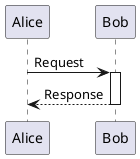
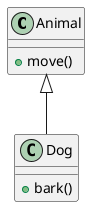
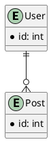

# PlantUML Diagram Generation

## Table of Contents

- [Purpose](#purpose)
- [When to Use This Skill](#when-to-use-this-skill)
- [Prerequisites](#prerequisites)
- [Creating Diagrams](#creating-diagrams)
  - [Diagram Type Identification](#diagram-type-identification)
  - [Resilient Workflow](#resilient-workflow-primary---recommended)
- [Creating Diagrams from Source Code](#creating-diagrams-from-source-code)
- [Best Practices](#best-practices)
- [Troubleshooting](#troubleshooting)
- [References](#references)

## Purpose

This skill enables PlantUML diagram creation workflows. PlantUML is a text-based diagramming tool that generates professional diagrams from simple, intuitive syntax.

**Core capabilities:**

1. Create diagrams from natural language descriptions
2. Create architecture diagrams from source code examples (Spring Boot, FastAPI, Python ETL, Node.js, React)
3. Validate PlantUML syntax

## When to Use This Skill

**Activate for:**

- Diagram creation requests (e.g., "Create a sequence diagram showing authentication flow")
- Code architecture visualization (e.g., "Create deployment diagram for my Spring Boot app")
- Specific diagram types: UML (sequence, class, activity, state, component, deployment, use case, object, timing) or non-UML (ER, Gantt, mindmap, WBS, JSON/YAML, network, Archimate, wireframes)
- PlantUML syntax validation


## Prerequisites

For full functionality including syntax validation, install these components:

| Component | Purpose | Installation |
|-----------|---------|--------------|
| Java JRE/JDK 8+ | Runtime | https://www.oracle.com/java/technologies/downloads/ |
| plantuml.jar | Diagram generator | https://plantuml.com/download (place in `~/plantuml.jar` or set `PLANTUML_JAR`) |
| Graphviz (optional) | Complex layouts | https://graphviz.org/download/ |

## Creating Diagrams

### Diagram Type Identification

Identify the appropriate diagram type based on user intent:

| User Intent | Diagram Type | Reference |
|-------------|--------------|-----------|
| Interactions over time | Sequence | `references/sequence_diagrams.md` |
| System structure with classes | Class | `references/class_diagrams.md` |
| Workflows, decision flows | Activity | `references/activity_diagrams.md` |
| Object states and transitions | State | `references/state_diagrams.md` |
| Database schemas | ER (Entity Relationship) | `references/er_diagrams.md` |
| Project timelines | Gantt | `references/gantt_diagrams.md` |
| Idea organization | MindMap | `references/mindmap_diagrams.md` |
| System architecture | Component | `references/component_diagrams.md` |
| Actors and features | Use Case | `references/use_case_diagrams.md` |
| All 19 types | See navigation hub | `references/toc.md` |

**Syntax resources:**

- `references/toc.md`: Navigation hub linking to all diagram types
- `references/common_format.md`: Universal elements (delimiters, metadata, comments, notes)
- `references/styling_guide.md`: Modern `<style>` syntax for visual customization

### Resilient Workflow (Primary - Recommended)

For reliable diagram creation, follow this workflow:

**Step 1: Identify Diagram Type & Load Reference**
- Identify diagram type from user intent
- Load `references/[diagram_type]_diagrams.md` for syntax guide
- Consult `references/toc.md` if ambiguous

**Step 2: Create Diagram Content**
- Write PlantUML syntax following the reference guide
- Use descriptive participant names and clear message labels
- For sequence diagrams, use activation/deactivation to show processing time when possible

**Step 3: Validate Syntax (if environment available)**
- Check syntax using PlantUML's built-in validation (e.g., `java -jar plantuml.jar --check-syntax file.puml`)
- If errors occur, consult `references/troubleshooting/toc.md` for error classification and specific guides

**Step 4: Save or Embed Diagram**
- **For file-based diagrams**: Save as `.puml` file with structured naming: `./diagrams/<context>_<num>_<type>_<title>.puml`
- **For embedded diagrams**: Include directly in documentation with `@startuml`/`@enduml` delimiters
  - in markdown use multiline code tag - ```plantuml


### Quick Syntax Reference

**Common elements:**

- Delimiters: `@startuml` / `@enduml` (required)
- Comments: `' Single line` or `/' Multi-line '/`
- Relationships: `->` (solid), `-->` (dashed), `..>` (dotted)
- Labels: `A -> B : Label text`

**Minimal examples** (see `references/[type]_diagrams.md` for comprehensive syntax):







## Creating Diagrams from Source Code

The `examples/` directory contains language-specific templates for creating diagrams from common application architectures:

| Application Type | Directory | Key Diagrams |
|------------------|-----------|--------------|
| Spring Boot | `examples/spring-boot/` | Deployment, Component, Sequence |
| FastAPI | `examples/fastapi/` | Deployment, Component (async routers) |
| Python ETL | `examples/python-etl/` | Architecture with Airflow |
| Node.js | `examples/nodejs-web/` | Express/Nest.js components |
| React | `examples/react-frontend/` | SPA deployment, component architecture |

**Workflow:**
1. Identify application type
2. Review example in `examples/[app-type]/`
3. Map code structure to diagram patterns
4. **Add source annotations**: Include file paths and line numbers in comments for participants/components (e.g., `/'source: @/dir/file.js'/` or `/'source: @/dir/file.js:56'/`)
5. Copy and adapt the example `.puml` file
6. Use Unicode symbols from `references/unicode_symbols.md` for semantic clarity


## Best Practices

**Diagram Quality:**
- Use descriptive filenames from diagram content (when saving in file)
- Add comments with `'` for clarity
- Follow standard UML notation
- Test incrementally before adding complexity

**Source Code Annotations (for diagrams from real codebases):**
- **Always include source references**: Add file path and optional line number comments for participants/components
- **Format**: Use multi-line comments `/'...'/` after participant/component declarations
- **Path convention**: Use `@/` prefix for paths relative to project root (e.g., `/'source: @/src/services/auth.js'/`)
- **Line numbers**: Include line numbers when referencing specific functions/methods (e.g., `/'source: @/src/services/auth.js:56'/`)
- **Box annotations**: Add source to box definitions for module-level grouping (e.g., `box "Auth Module" /'source: @/src/auth'/`)
- **Example**:
  ```puml
  @startuml
  box "Auth Module" /'source: @/src/auth'/
    participant "validateToken" as VT /'source: @/src/auth/token.js:45'/
    participant "hashPassword" as HP /'source: @/src/auth/password.js:78'/
  end box
  @enduml
  ```

**Consistent Typing Across Diagrams:**
- **Maintain consistent representation**: The same conceptual entity should use the same PlantUML type (`participant`, `entity`, `control`, etc.) and alias across all diagrams
- **Choose types semantically**: Use `entity` for data structures, `control` for controllers, `actor` for external systems, `database` for data stores
- **Document type decisions**: For complex systems, create a glossary mapping entities to PlantUML types
- **Review for consistency**: Check all diagrams in a documentation set for consistent representation of key entities

**Sequence Diagram Guidelines:**
- Use activation/deactivation (`activate`/`deactivate`) to show processing time and method execution scope
- Balance every `activate` with a corresponding `deactivate`
- Use colored activations for visual distinction when helpful
- Show nested activations for complex call sequences
- **Group loops and conditionals**: Use `loop` for repetitive sequences, `alt`/`else` for conditional branches
- **Never box actors, box logical modules only**: Actors (human users, external systems) must never be boxed as they are outside the system boundary. Use `box` only for participants belonging to a common high-level module or layer. Do not box standalone infrastructure. Use distinct light colors (e.g., `#LightBlue`, `#LightGreen`) and limit nesting to 2 levels
- Reference `references/sequence_diagrams.md` for comprehensive syntax

**Styling:** Apply modern `<style>` syntax from `references/styling_guide.md`:

```puml
@startuml
<style>
classDiagram {
  class { BackgroundColor LightBlue }
}
</style>
' diagram content
@enduml
```

**Themes:** `!theme cerulean` (also: `bluegray`, `plain`, `sketchy`, `amiga`)

**Unicode symbols:** Add semantic meaning with symbols from `references/unicode_symbols.md`:

```puml
node "☁️ AWS Cloud" as aws
database "💾 PostgreSQL" as db
```

## Troubleshooting

**Quick diagnosis:**
1. Check syntax: `java -jar plantuml.jar --check-syntax file.puml`
2. Identify error type
3. Load troubleshooting guide: `references/troubleshooting/toc.md`

**Common issues:**

| Issue | Solution |
|-------|----------|
| "plantuml.jar not found" | Download from https://plantuml.com/download, set `PLANTUML_JAR` |
| "Graphviz not found" | Install from https://graphviz.org/download/ |
| "Syntax Error" | Check delimiters match, consult `references/common_format.md` |
| "Java not found" | Install Java JRE/JDK 8+, verify with `java -version` |

**Comprehensive guides** (215+ errors documented):
- `references/troubleshooting/toc.md` - Navigation hub with error decision tree
- `references/troubleshooting/[category]_guide.md` - 12 focused guides by error type

## References

### Core Syntax References

| Resource | Purpose |
|----------|---------|
| `references/toc.md` | Navigation hub for all 19 diagram types |
| `references/common_format.md` | Universal elements (delimiters, metadata, comments) |
| `references/styling_guide.md` | Modern `<style>` syntax with CSS-like rules |
| `references/plantuml_reference.md` | Installation, CLI, and troubleshooting |

### Troubleshooting Guides

| Resource | Coverage |
|----------|----------|
| `references/troubleshooting/toc.md` | Navigation hub with error decision tree |
| `references/troubleshooting/installation_setup_guide.md` | Setup problems |
| `references/troubleshooting/general_syntax_guide.md` | Syntax errors |
| `references/troubleshooting/[diagram_type]_guide.md` | Diagram-specific errors |

### Enrichment Resources

| Resource | Purpose |
|----------|---------|
| `references/unicode_symbols.md` | Unicode symbols for semantic enrichment |
| `examples/[framework]/` | Code-to-diagram patterns |

## Summary

1. **Check prerequisites**: Install Java and plantuml.jar for validation (optional for syntax creation)
2. **Navigate types**: Start with `references/toc.md`
3. **Learn syntax**: Open `references/[diagram_type]_diagrams.md`
4. **Apply styling**: Use `references/styling_guide.md`
5. **Add symbols**: Use `references/unicode_symbols.md`
6. **Troubleshoot**: `references/troubleshooting/toc.md`

**Supported diagrams:**
- UML: sequence, class, activity, state, component, deployment, use case, object, timing
- Non-UML: ER, Gantt, mindmap, WBS, JSON/YAML, network, Archimate, wireframes
