# Sequence Diagrams

Sequence diagrams illustrate how participants interact over time, showing the flow of messages and temporal ordering of events. They excel at documenting interaction protocols, communication flows, and complex multi-actor processes.

## Basic Syntax

The simplest sequence diagram declares participants and defines messages between them. Participants can be implicit (created on first mention) or explicit (declared with the `participant` keyword for more control):

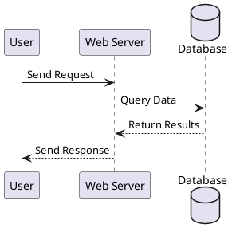

**Best Practice**: Always use the `loop` construct for iterative processes instead of text labels like 'for each'. This makes the iteration explicit and the diagram more structured.

**Example - Converting text labels to proper loops:**

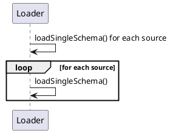


## Participant Customization

### Renaming with Aliases

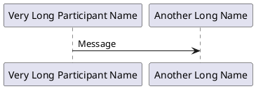

### Controlling Order

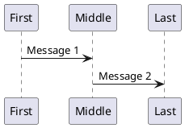

### Multiline Participant Names

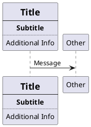

### Colored Participants

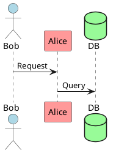

## Activation and Lifelines

Activation (lifelines) shows when a participant is active or processing:

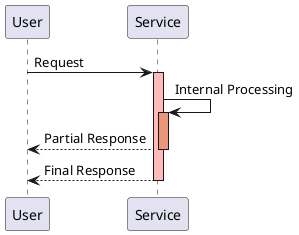

### Shorthand Activation Syntax

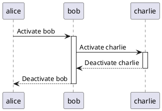

### Creation and Destruction

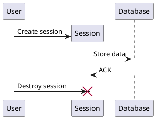

## Message Types and Arrows

PlantUML supports various message arrow styles:

- `->` Solid arrow (synchronous message)
- `-->` Dashed arrow (return/async message)
- `->>` Asynchronous message
- `<-` Reverse solid (for code readability)
- `<--` Reverse dashed
- `-\\` Lost message (message that doesn't reach destination)
- `/-` Found message (message from unknown source)
- `->x` Message with destruction
- `->o` Message to boundary
- `->>o` Async message to boundary

**Example:**

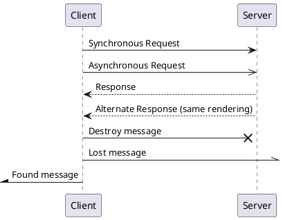

## System Boundary Messages

Messages from/to system boundaries:

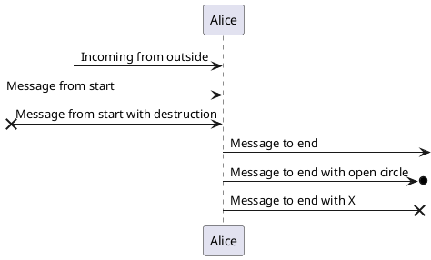

## Messages to Self

Show internal processing:

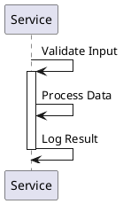

## Grouping and Control Structures

Use grouping constructs (`alt`/`else`, `loop`, `opt`, `par`, `group`) to organize related messages and improve diagram readability. Always group repetitive loops and conditional branches to clarify logic flow.

### Alt/Else (Alternative Paths)

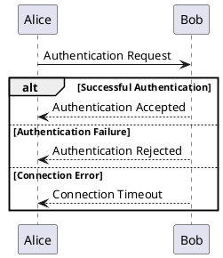

### Opt (Optional)

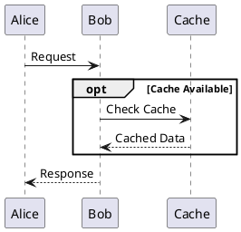

### Loop

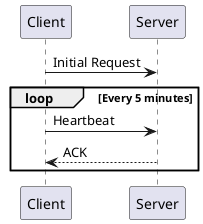

### Par (Parallel)

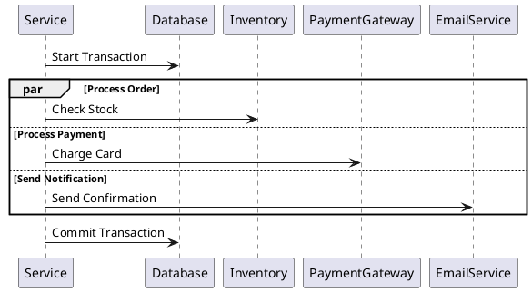

### Group

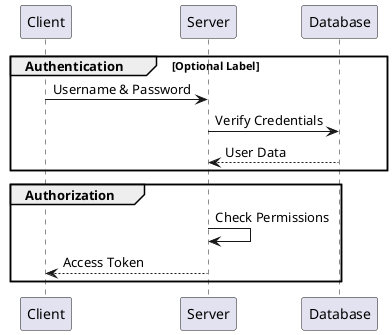

### Box (Participant Grouping)

Group participants belonging to the same module or subsystem using `box`. Use light colors to differentiate boxes, and limit nesting to at most 2 levels for clarity.

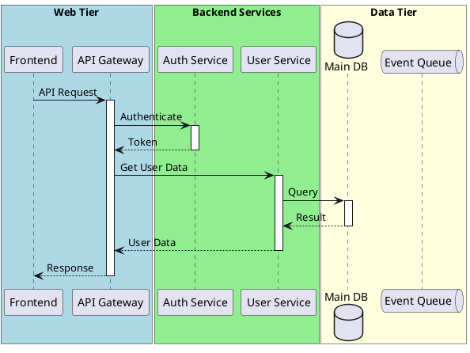

**Guidelines:**

**Boxing Rules:**
1. **Actors must never be boxed**: Actors (human users, external systems) represent entities outside the system boundary and must never be placed inside boxes. This is a fundamental architectural principle.

2. **Box logical modules, not isolated participants**: Use `box` only for participants belonging to a common high-level module or layer. Do not box:
   - External actors (e.g., `actor "User"`, `actor "HTTP Client"`) - **FORBIDDEN**
   - Standalone databases or queues when no higher abstraction is shown
   - Individual participants without a shared module context

3. **Use multi‑boxing for hierarchy**: When multiple abstraction layers exist, nest boxes to show containment. Limit nesting to **2 levels maximum** for clarity.

4. **Assign distinct light colors**: Use colors like `#LightBlue`, `#LightGreen`, `#LightYellow` to visually separate different boxes.

5. **Combine with control structures**: Use `box` together with `group`, `alt`, `loop`, etc., to create clear, structured diagrams.

**Common Mistakes - Anti-patterns:**
- **❌ Actor inside box**: Placing an actor inside a box incorrectly suggests the actor is part of the system
  ```puml
  @startuml
  ' ❌ INCORRECT: Actor inside box
  box "System" #LightBlue
    actor "User" as User
    participant "Service" as Service
  end box
  
  User -> Service : Request
  @enduml
  ```
- **✅ Correct: Actor outside box**
  ```puml
  @startuml
  ' ✅ CORRECT: Actor outside box
  actor "User" as User
  
  box "System" #LightBlue
    participant "Service" as Service
  end box
  
  User -> Service : Request
  @enduml
  ```

**Example:**
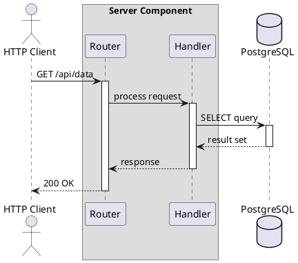

**Explanation:**
- `actor "HTTP Client"` is external and not boxed.
- Top‑level box `"Application Server"` represents the deployment unit.
- Nested box `"Server Component"` groups participants belonging to the same source directory.
- `database "PostgreSQL"` is a standalone infrastructure component and not boxed.
- Source references (`/'...'/`) are added to boxes and participants.

### Source Code References (for diagrams from real codebases)

When creating diagrams from actual source code, include file path and line number references in comments to trace participants back to their implementation.

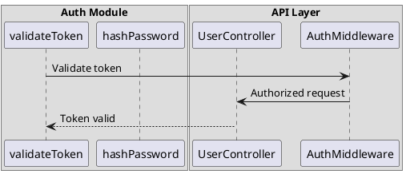

**Conventions:**
- Use multi-line comments `/'...'/` for source references
- Prefix paths with `@/` to indicate project-relative paths
- Include line numbers when referencing specific functions/methods (`:line`)
- Add source references to `box` definitions for module-level grouping
- Add source references to `participant` declarations for individual components
- Use consistent path format throughout the diagram

## Consistent Naming and Typing Across Diagrams

Maintain consistent representation of the same conceptual entities across different diagrams to improve readability and avoid confusion.

**Guidelines for choosing participant types:**
- `actor` - Human users, external systems (outside system boundary)
- `participant` - Active components, services, controllers
- `entity` - Data structures (DTOs, structs, models, value objects)
- `control` - Controllers, coordinators, managers
- `database` - Databases, data stores
- `boundary` - System boundaries, interfaces
- `collections` - Collections of items
- `queue` - Message queues, event buses

**Rule:** The same conceptual entity should use the same type and alias across all diagrams in a documentation set.

**Example - Consistent `RouteMapping` representation:**
```puml
@startuml
' ✅ CORRECT: Consistent entity type for data structure
entity "RouteMapping" as RouteMapping /'source: @/internal/server/interfaces.go:19'/

' ❌ INCORRECT: Inconsistent typing (sometimes participant, sometimes entity)
participant "RouteMapping" as RM /'source: @/internal/server/interfaces.go:19'/
@enduml
```

**Best Practices:**
1. **Choose types semantically**: Select participant type based on the entity's role in the system
2. **Use consistent aliases**: Use the same alias (e.g., `RouteMapping`) across all diagrams
3. **Document type decisions**: For complex systems, maintain a glossary mapping entities to PlantUML types
4. **Review for consistency**: Check all diagrams in a documentation set for consistent representation

## Notes and Annotations

### Basic Notes

```puml
@startuml
Alice -> Bob : Message
note left: This is a note on the left side
note right: This is a note on the right side
note over Alice: Note over Alice
note over Alice, Bob
    This note spans across
    both Alice and Bob
end note
@enduml
```

### Note Styles

```puml
@startuml
Alice -> Bob : Message
note left #lightblue: Colored note

hnote over Alice : Hexagonal note
rnote over Bob : Rectangle note
@enduml
```

### Notes on Messages

```puml
@startuml
Alice -> Bob : Message
note on link
    This note is directly
    on the message arrow
end note
@enduml
```

## Spacing and Formatting

### Manual Spacing

```puml
@startuml
Alice -> Bob : Message 1

|||

Alice -> Bob : Message 2 (with automatic spacing)

||50||

Alice -> Bob : Message 3 (with 50 pixels spacing)
@enduml
```

### Dividers

```puml
@startuml
== Initialization ==
Alice -> Bob : Connect

== Authentication ==
Alice -> Bob : Login
Bob --> Alice : Token

== Data Transfer ==
Alice -> Bob : Request Data
Bob --> Alice : Send Data

== Cleanup ==
Alice -> Bob : Disconnect
@enduml
```

### Delay Marker

```puml
@startuml
Alice -> Bob : Request
...5 minutes later...
Bob --> Alice : Response

...
Alice -> Bob : Another Request
@enduml
```

## Advanced Features

### Reference to Other Diagrams

```puml
@startuml
participant Alice
participant Bob

ref over Alice, Bob : Complex Authentication Process\n(see auth_detail.puml)

Alice -> Bob : Continue with main flow
@enduml
```

### Numbered Messages

```puml
@startuml
autonumber
Alice -> Bob : First message
Bob --> Alice : Response
Alice -> Bob : Second message
Bob --> Alice : Response
@enduml
```

**Customized Numbering:**

```puml
@startuml
autonumber 10 10 "<b>[000]"
Alice -> Bob : Message 10
Bob --> Alice : Response 20
autonumber stop
Alice -> Bob : No number
autonumber resume
Alice -> Bob : Message 30
@enduml
```

### Message Delays

```puml
@startuml
Alice -> Bob : Request
... 5 minutes later ...
Bob --> Alice : Response
@enduml
```

## Real-World Example: Authentication Flow

```puml
@startuml
actor User
participant "Web App" as Web
participant "Auth Service" as Auth
database "User DB" as DB
participant "Email Service" as Email

User -> Web : Enter credentials
activate Web

Web -> Auth : Authenticate(username, password)
activate Auth

Auth -> DB : Query user by username
activate DB
DB --> Auth : User record
deactivate DB

alt Password Valid
    Auth -> Auth : Generate JWT token
    Auth -> DB : Update last_login
    activate DB
    DB --> Auth : Success
    deactivate DB

    Auth --> Web : JWT token
    deactivate Auth

    Web --> User : Redirect to dashboard
    deactivate Web

    par Send notification
        Auth -> Email : Send login notification
        activate Email
        Email --> Auth : Email sent
        deactivate Email
    end

else Password Invalid
    Auth --> Web : Authentication failed
    deactivate Auth

    Web --> User : Show error message
    deactivate Web

    alt Too many failures
        Web -> Auth : Lock account
        activate Auth
        Auth -> DB : Set account_locked = true
        activate DB
        DB --> Auth : Success
        deactivate DB
        Auth -> Email : Send security alert
        activate Email
        Email --> Auth : Email sent
        deactivate Email
        deactivate Auth
    end
end
@enduml
```

## Tips and Best Practices

1. **Use meaningful aliases** - `as` keyword for long names
2. **Order participants logically** - Left to right, user to system
3. **Group related interactions** - Use `group`, `alt`, `loop`, `opt`, `par` to organize logic flow
4. **Use explicit loop constructs** - Always use `loop` for iterative processes instead of text labels like 'for each'
5. **Never box actors, box logical modules only** - Actors (human users, external systems) must never be boxed as they are outside the system boundary. Use `box` only for participants belonging to a common high-level module or layer. Do not box standalone infrastructure (databases, queues) when no higher abstraction is shown.
6. **Use multi‑boxing for hierarchy (max 2 levels)** - When multiple abstraction layers exist, nest boxes to show containment. Limit nesting to 2 levels maximum for clarity.
7. **Include source references** - For diagrams from real codebases, add file path and line number comments (e.g., `/'source: @/dir/file.js:56'/`) to participants and boxes
8. **Add notes for clarity** - Explain complex business logic
9. **Use dividers** - Separate major phases with `==`
10. **Activate/deactivate consistently** - Show processing time accurately
11. **Choose appropriate arrow types** - Solid for synchronous, dashed for returns
12. **Autonumber for complex flows** - Easier to reference in discussions

## Common Use Cases

- **API interactions** - RESTful, gRPC, SOAP protocols
- **Authentication flows** - OAuth, SAML, JWT
- **Transaction processing** - Payment, order processing
- **Microservice communication** - Service-to-service calls
- **Database transactions** - Query sequences, ACID operations
- **Error handling** - Retry logic, fallback mechanisms

## Conversion to Images

```bash
# PNG
java -jar plantuml.jar sequence.puml

# SVG (recommended for documentation)
java -jar plantuml.jar -tsvg sequence.puml
```

See [plantuml_reference.md](plantuml_reference.md) for comprehensive CLI documentation.
