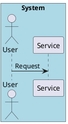
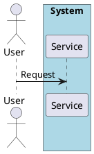
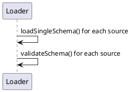
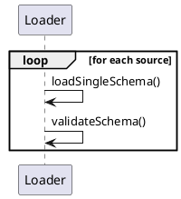
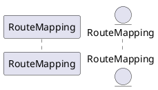
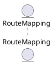
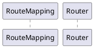
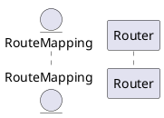
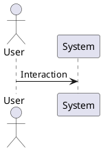

# PlantUML Diagram Validation and Best Practices Guide

This guide provides validation rules and common anti-patterns to ensure PlantUML diagrams follow consistent conventions, especially for sequence diagrams in technical documentation.

## Why Validate Diagrams?

Well-structured diagrams improve:
- **Readability**: Clear visual communication of system interactions
- **Maintainability**: Consistent patterns make diagrams easier to update
- **Accuracy**: Proper representation of system boundaries and relationships
- **Professionalism**: High-quality documentation standards

## Validation Checklist

Before finalizing any PlantUML diagram, verify these rules:

### 1. Actor Placement Validation
- [ ] **Actors are NEVER boxed**: Actors (human users, external systems) must be outside all boxes
- [ ] **Actor type is used correctly**: Use `actor` for human users and external systems
- [ ] **Actor position**: Typically placed at diagram edges (left for initiators)

### 2. Loop Construct Validation
- [ ] **No text-label iterations**: Replace "for each source" text labels with explicit `loop` constructs
- [ ] **Proper loop syntax**: Use `loop [condition]` with `end` statement
- [ ] **Clear loop labels**: Descriptive labels explaining iteration context

### 3. Participant Type Consistency
- [ ] **Same entity, same type**: Identical conceptual entities use same PlantUML type across all diagrams
- [ ] **Semantic type selection**: Choose appropriate types (`participant`, `entity`, `control`, `database`, etc.)
- [ ] **Consistent aliases**: Use same alias for same entity across diagrams

### 4. Source Annotation Validation (for code-based diagrams)
- [ ] **All participants have source references**: Each participant/entity includes `/'source: @/path/to/file[:line]'/`
- [ ] **Boxes have source references**: Module/component boxes include source directory references
- [ ] **Consistent path format**: Use `@/` prefix for project-relative paths
- [ ] **Line numbers included**: For specific functions/methods, include line numbers

### 5. Box Grouping Validation
- [ ] **Logical grouping only**: Box only participants belonging to same module/layer
- [ ] **No isolated participants**: Don't box standalone databases, queues, or external actors
- [ ] **Nesting limited to 2 levels**: Maximum box nesting depth for clarity
- [ ] **Distinct light colors**: Use colors like `#LightBlue`, `#LightGreen` for visual separation

## Common Anti-patterns and Fixes

### Anti-pattern 1: Actor Inside Box

**Incorrect (Architecturally Wrong):**


**Problem:** Suggests user is part of the system, violating system boundary principles.

**Correct (Actor Outside Box):**


### Anti-pattern 2: Text Label Instead of Loop Construct

**Incorrect (Unclear Iteration):**


**Problem:** Implicit iteration is not visually clear; diagram doesn't show loop structure.

**Correct (Explicit Loop):**


### Anti-pattern 3: Inconsistent Participant Typing

**Incorrect (Mixed Types for Same Entity):**


**Problem:** Confusing representation; readers may think these are different entities.

**Correct (Consistent Typing):**


**Guideline:** Choose type based on entity role:
- `entity` for data structures (DTOs, models, value objects)
- `participant` for active components, services
- `control` for controllers, coordinators
- `database` for databases, data stores
- `actor` for external systems/humans

### Anti-pattern 4: Missing Source Annotations

**Incorrect (No Traceability):**


**Problem:** Cannot locate source code for diagram elements; reduces maintainability.

**Correct (With Source References):**


## Validation Workflow

### Step 1: Automated Syntax Check
```bash
java -jar plantuml.jar --check-syntax diagram.puml
```

### Step 2: Manual Review Against Checklist
1. Open diagram in PlantUML viewer
2. Go through validation checklist above
3. Verify each rule compliance

### Step 3: Cross-Diagram Consistency Check
1. Compare all diagrams in documentation set
2. Ensure consistent representation of key entities
3. Verify uniform styling and conventions

### Step 4: Source Code Verification (for code-based diagrams)
1. Check that all source paths exist
2. Verify line numbers reference correct functions
3. Ensure paths use consistent project-relative format

## Quick Reference: Validation Rules Summary

| Rule | Example | Status |
|------|---------|--------|
| Actors never boxed | `actor "User"` outside boxes | **REQUIRED** |
| Use explicit loops | `loop for each` not text labels | **REQUIRED** |
| Consistent typing | Same entity = same type across diagrams | **REQUIRED** |
| Source annotations | `/'source: @/path/to/file:line'/` | **REQUIRED for code diagrams** |
| Box logical modules | Group related participants | **REQUIRED** |
| Light box colors | `#LightBlue`, `#LightGreen` | **RECOMMENDED** |
| Max 2-level nesting | Avoid deep box hierarchies | **RECOMMENDED** |

## Integration with Development Workflow

### Pre-commit Hook Example
Add to `.git/hooks/pre-commit` (or use pre-commit framework):

```bash
#!/bin/bash
# Validate PlantUML files
for file in $(find . -name "*.puml" -type f); do
  echo "Validating $file"
  java -jar ~/plantuml.jar --check-syntax "$file" || exit 1
  
  # Additional custom validations
  if grep -q "box.*actor" "$file"; then
    echo "ERROR: $file contains actor inside box"
    exit 1
  fi
  
  if grep -q "for each" "$file" && ! grep -q "loop" "$file"; then
    echo "WARNING: $file may have text-label iterations"
  fi
done
```

### CI/CD Pipeline Integration
```yaml
# GitHub Actions example
jobs:
  validate-diagrams:
    runs-on: ubuntu-latest
    steps:
      - uses: actions/checkout@v3
      - name: Setup PlantUML
        run: |
          sudo apt-get update
          sudo apt-get install -y graphviz default-jre
          wget -O plantuml.jar https://github.com/plantuml/plantuml/releases/download/v1.2023.1/plantuml.jar
      - name: Validate diagrams
        run: |
          find . -name "*.puml" -exec java -jar plantuml.jar --check-syntax {} \;
```

## Troubleshooting Validation Issues

### Common Validation Failures

1. **"Actor inside box" violation**
   - **Cause**: Actor placed within `box`/`end box` boundaries
   - **Fix**: Move actor declaration outside all boxes

2. **Missing source annotations**
   - **Cause**: Participants without `/'source: ...'/` comments
   - **Fix**: Add source references to all participants and boxes

3. **Inconsistent entity typing**
   - **Cause**: Same entity uses different types across diagrams
   - **Fix**: Create entity-type mapping table and standardize

4. **Text-label iterations**
   - **Cause**: Using "for each" in message labels instead of `loop`
   - **Fix**: Convert to explicit `loop` construct

### Validation Exceptions

Some diagrams may legitimately deviate from rules:
- **Conceptual diagrams**: High-level architecture may omit source references
- **Legacy diagrams**: Existing documentation may be updated gradually
- **External specifications**: Diagrams following external standards

Document any exceptions with comments in the `.puml` file:


## Additional Resources

- [Sequence Diagram Guidelines](../sequence_diagrams.md) - Comprehensive syntax and best practices
- [PlantUML Official Documentation](https://plantuml.com/) - Complete language reference
- [Diagram Consistency Checklist](../common_format.md) - Formatting and style conventions

## Contributing to Validation Rules

Found a new anti-pattern? Add it here:
1. Describe the anti-pattern and its problem
2. Provide incorrect/correct examples
3. Update validation checklist
4. Submit via pull request