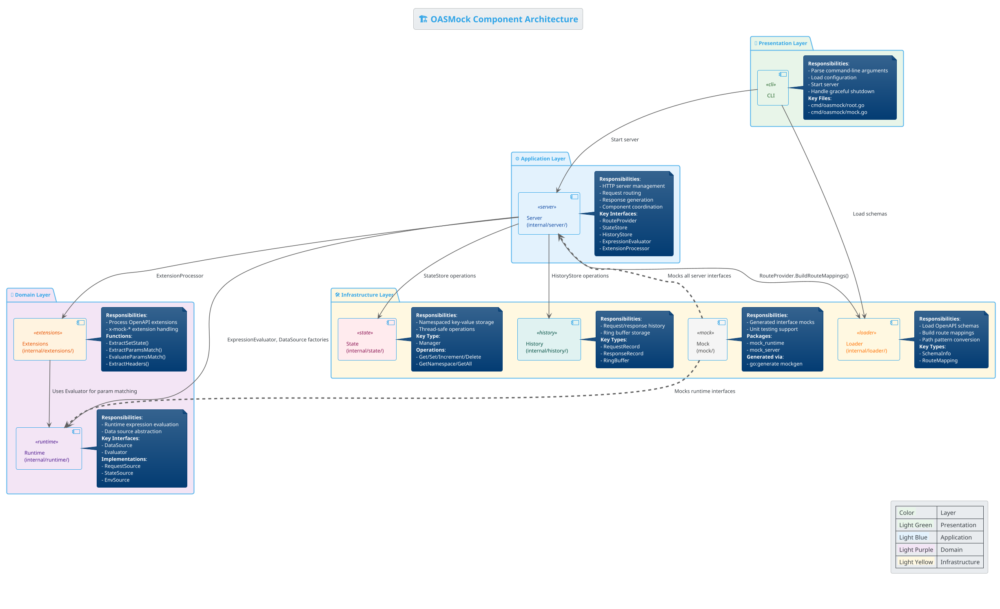
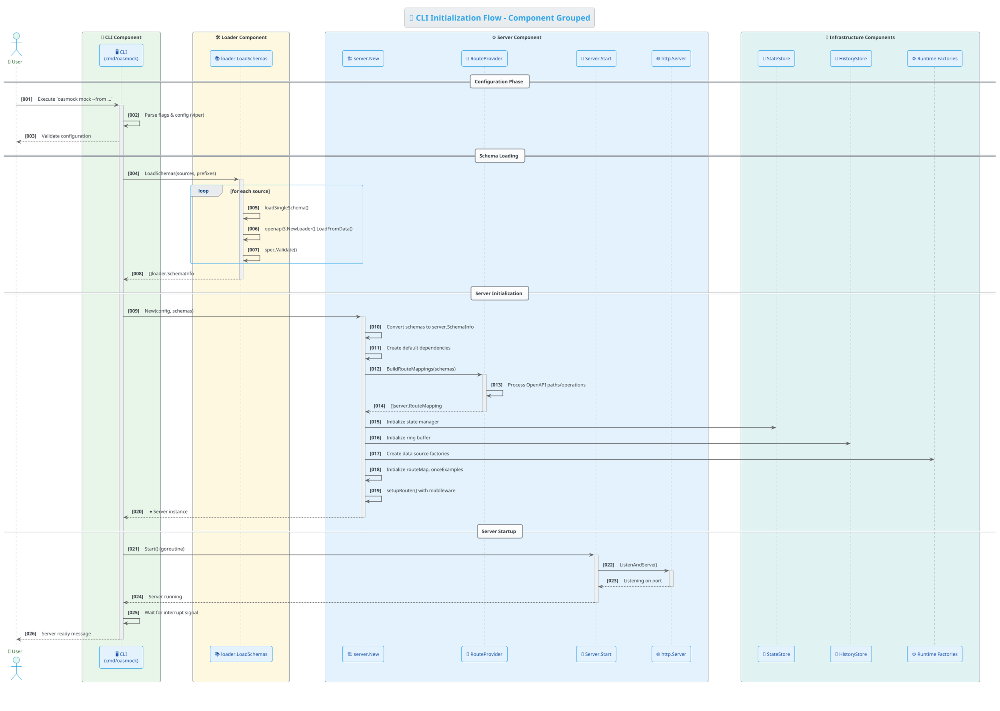
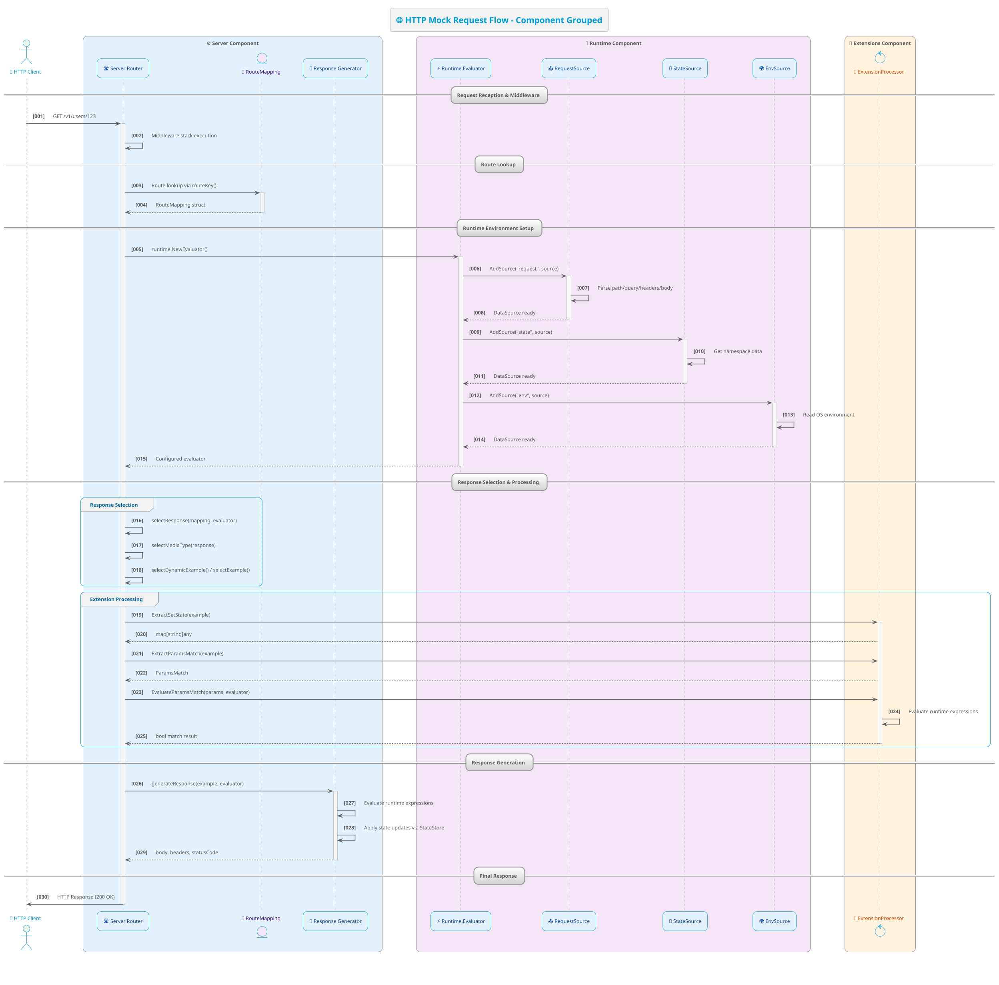
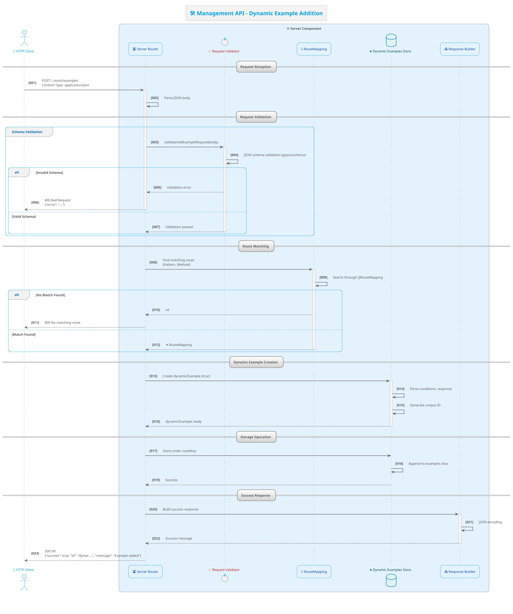

# OASMock Architecture Documentation

## Table of Contents
1. [Overview](#overview)
   - [Diagram Conventions](#diagram-conventions)
2. [Component Architecture](#1-component-architecture)
3. [Component Details](#2-component-details)
   - [2.1 CLI Component](#21-cli-component-cmdoasmock)
   - [2.2 Server Component](#22-server-component-internalserver)
   - [2.3 Runtime Component](#23-runtime-component-internalruntime)
   - [2.4 Extensions Component](#24-extensions-component-internalextensions)
   - [2.5 Loader Component](#25-loader-component-internalloader)
   - [2.6 State Component](#26-state-component-internalstate)
   - [2.7 History Component](#27-history-component-internalhistory)
   - [2.8 Mock Component](#28-mock-component-mock)
4. [Sequence Flows](#3-sequence-flows)
   - [3.1 CLI Initialization Flow](#31-cli-initialization-flow)
   - [3.2 HTTP Mock Request Flow](#32-http-mock-request-flow)
   - [3.3 Management API - Dynamic Example Addition](#33-management-api---dynamic-example-addition)
5. [Interface Definitions](#4-interface-definitions)
   - [4.1 Server Interfaces](#41-server-interfaces-internalserverinterfacesgo)
   - [4.2 Runtime Interfaces](#42-runtime-interfaces-internalruntimeexpressiongo)
   - [4.3 Extension Functions](#43-extension-functions-internalextractionsextractgo)
6. [Data Flow Summary](#5-data-flow-summary)
7. [Design Patterns](#6-design-patterns)
8. [Testing Architecture](#7-testing-architecture)
9. [Extension Points](#8-extension-points)
10. [Performance Considerations](#9-performance-considerations)
11. [Conclusion](#conclusion)

## Overview

OASMock is an OpenAPI-based mock server with a modular architecture built in Go. This document describes the system's architecture, components, interfaces, and data flows using PlantUML diagrams for visual clarity.

### Diagram Conventions

All PlantUML diagrams in this document follow the guidelines from the [plantuml-creator skill](../.opencode/skills/plantuml-creator/SKILL.md) to ensure consistency and maintainability:

- **Source annotations**: Each diagram element that corresponds to actual code includes a source reference in the format `/'source: @/path/to/file.go:line'/` linking to the relevant file and line number.
- **Modern styling**: Diagrams use the modern `<style>` tag with CSS-like syntax instead of legacy `skinparam` commands.
- **Consistent typing**: The same conceptual entity uses the same PlantUML type (`component`, `participant`, `control`, etc.) and alias across all diagrams.
- **Loop constructs**: Iterative processes are expressed with explicit `loop` blocks instead of text labels.
- **Activation/deactivation**: Sequence diagrams balance every `activate` with a corresponding `deactivate` to show processing scope.
- **Legends and captions**: Diagrams include legends explaining color coding and captions for figure numbering.
- **Unicode symbols**: Emojis and symbols (🎯, ⚙️, 🔧) provide visual semantics.

## 1. Component Architecture



## 2. Component Details

### 2.1 CLI Component (`cmd/oasmock/`)
**Purpose**: Command-line interface using Cobra framework.
- **Key Files**:
  - `root.go` - Root command setup and error handling
  - `mock.go` - Main mock server command with configuration parsing
  - `main.go` - Application entry point
- **Responsibilities**:
  - Parse command-line flags and environment variables
  - Validate configuration (ports, paths, etc.)
  - Load OpenAPI schemas via Loader component
  - Initialize and start Server component
  - Handle interrupt signals for graceful shutdown
- **Dependencies**: Server, Loader

### 2.2 Server Component (`internal/server/`)
**Purpose**: Core HTTP server and component coordination.
- **Key Files**:
  - `server.go` - Main server implementation and HTTP handlers
  - `interfaces.go` - All public interfaces and dependency definitions
  - `server_management.go` - Management API endpoints
  - `wrappers.go` - Adapter implementations
- **Public Interfaces**:
  - `RouteProvider` - Builds route mappings from OpenAPI schemas
  - `StateStore` - Manages namespaced state with CRUD operations
  - `HistoryStore` - Stores request/response history records
  - `DataSource` - Generic data source for runtime expressions
  - `ExpressionEvaluator` - Evaluates runtime expressions (`{$request.path.id}`)
  - `ExtensionProcessor` - Processes OpenAPI extensions (`x-mock-*`)
- **Responsibilities**:
  - HTTP request routing using Chi router
  - Middleware stack (CORS, logging, delay, history)
  - Response generation and example selection
  - Runtime expression evaluation coordination
  - Extension processing and state updates
  - Management API endpoints (`/_mock/examples`, `/_mock/requests`)
- **Dependencies**: Loader, Runtime, Extensions, State, History

### 2.3 Runtime Component (`internal/runtime/`)
**Purpose**: Runtime expression evaluation engine.
- **Key Files**:
  - `expression.go` - Core expression parsing and evaluation
- **Public Interfaces**:
  - `DataSource` - `Get(path string) (any, bool)` interface
  - `Evaluator` - `AddSource(name, source)`, `Evaluate(expr) (any, error)`
- **Implementations**:
  - `RequestSource` - Access to HTTP request data (path params, query, headers, body, cookies)
  - `StateSource` - Access to namespaced server state
  - `EnvSource` - Access to environment variables
- **Responsibilities**:
  - Parse dot-separated paths with escape support (`path.id`, `query.page`)
  - Evaluate runtime expressions (`{$request.path.id | default:0}`)
  - Apply modifiers (`default:`, `getByPath:`, `toJWT`)
- **Dependencies**: None (self-contained)

### 2.4 Extensions Component (`internal/extensions/`)
**Purpose**: OpenAPI extension processing for advanced mock behavior.
- **Key Files**:
  - `extract.go` - Extension extraction utilities
  - `match.go` - Parameter matching with JSON schema validation
- **Supported Extensions**:
  - `x-mock-set-state` - Set server state after response
  - `x-mock-skip` - Skip example from selection
  - `x-mock-once` - Use example only once
  - `x-mock-params-match` - Conditional example selection
  - `x-mock-headers` - Custom response headers
- **Functions**:
  - `ExtractSetState()`, `ExtractParamsMatch()`, `ExtractHeaders()`
  - `EvaluateParamsMatch()` - Uses Runtime.Evaluator for expression evaluation
  - `ExtractSkip()`, `ExtractOnce()`
- **Responsibilities**:
  - Extract extension values from OpenAPI examples
  - Validate JSON schemas for parameter matching
  - Evaluate runtime expressions in match conditions
- **Dependencies**: Runtime (for expression evaluation)

### 2.5 Loader Component (`internal/loader/`)
**Purpose**: OpenAPI schema loading and route mapping.
- **Key Files**:
  - `schema.go` - Schema loading and validation
  - `router.go` - Route mapping construction
- **Key Types**:
  - `SchemaInfo` - Loaded OpenAPI spec with prefix
  - `RouteMapping` - Route information for server routing
- **Functions**:
  - `LoadSchemas(sources, prefixes) ([]SchemaInfo, error)` - Load multiple schemas
  - `loadSingleSchema(path) (*openapi3.T, error)` - Load and validate single schema
  - `OpenAPIPatternToChi(pattern) string` - Convert OpenAPI patterns to Chi format
- **Responsibilities**:
  - Load OpenAPI YAML/JSON files from disk
  - Validate OpenAPI 3.0 schemas
  - Build route mappings for server registration
  - Handle path prefixing for multi-schema scenarios
- **Dependencies**: None (uses external `kin-openapi` library)

### 2.6 State Component (`internal/state/`)
**Purpose**: Thread-safe, namespaced key-value state management.
- **Key Files**:
  - `state.go` - Thread-safe state manager implementation
- **Key Type**:
  - `Manager` - Main state manager with sync.RWMutex
- **Operations**:
  - `Get(namespace, key) (any, bool)` - Retrieve value
  - `Set(namespace, key, value)` - Set key-value pair
  - `Increment(namespace, key, delta) (float64, error)` - Atomic increment
  - `Delete(namespace, key)` - Remove key
  - `GetNamespace(namespace) map[string]any` - Get all namespace data
  - `GetAll() map[string]map[string]any` - Get all state (debug)
- **Responsibilities**:
  - Thread-safe concurrent access management
  - Namespace isolation for multi-schema support
  - JSON-serializable value storage
- **Dependencies**: None (self-contained)

### 2.7 History Component (`internal/history/`)
**Purpose**: Request/response history storage with fixed-size ring buffer.
- **Key Files**:
  - `history.go` - Ring buffer implementation
- **Key Types**:
  - `RequestRecord` - HTTP request details (method, path, headers, body)
  - `ResponseRecord` - HTTP response details (status, headers, body, duration)
  - `RingBuffer` - Fixed-size circular buffer
- **Operations**:
  - `Add(record)` - Add request record (overwrites oldest when full)
  - `GetAll() []RequestRecord` - Get all records (chronological)
  - `Count() int` - Current record count
  - `Capacity() int` - Buffer capacity
  - `Clear()` - Remove all records
- **Responsibilities**:
  - Efficient storage with memory bounds
  - Chronological record retrieval
  - Thread-safe concurrent access
- **Dependencies**: None (self-contained)

### 2.8 Mock Component (`mock/`)
**Purpose**: Generated interface mocks for unit testing.
- **Packages**:
  - `mock_runtime` - Mocks for runtime interfaces (`DataSource`, `Evaluator`)
  - `mock_server` - Mocks for server interfaces (`RouteProvider`, `StateStore`, etc.)
- **Generation**:
  - Generated via `go:generate mockgen` directives
  - Separate packages for importability in tests
  - `_mock.go` suffix (not `_test.go`)
- **Responsibilities**:
  - Provide mock implementations for interface testing
  - Enable clean unit testing with dependency injection
  - Support test-driven development
- **Dependencies**: All interface packages (generated from them)

## 3. Sequence Flows

### 3.1 CLI Initialization Flow



**Description**:
1. **User Interaction**: CLI component parses command-line arguments and validates configuration
2. **Schema Loading**: Loader component loads and validates OpenAPI schemas from files
3. **Server Creation**: Server component initializes with dependencies including RouteProvider for route mapping
4. **Dependency Setup**: Infrastructure components (StateStore, HistoryStore, RuntimeFactories) are initialized
5. **Server Startup**: HTTP server starts listening on configured port

### 3.2 HTTP Mock Request Flow



**Description**:
1. **Request Reception**: Server component receives HTTP request and processes middleware
2. **Route Resolution**: RouteMapping lookup finds matching OpenAPI operation
3. **Runtime Setup**: Runtime component creates evaluator with data sources (Request, State, Env)
4. **Response Selection**: Server selects appropriate response based on operation and examples
5. **Extension Processing**: Extensions component processes x-mock-* extensions and evaluates conditions
6. **Response Generation**: Final response generated with evaluated runtime expressions

### 3.3 Management API - Dynamic Example Addition



**Description**:
1. **API Request**: Client sends POST request to management API endpoint
2. **Request Validation**: Server validates JSON payload against schema
3. **Route Matching**: Find existing RouteMapping for the specified path/method
4. **Example Creation**: Create dynamic example with conditions and response
5. **Storage**: Store example in Server's dynamic examples map
6. **Response**: Return success message with generated example ID

## 4. Interface Definitions

### 4.1 Server Interfaces (`internal/server/interfaces.go`)

```go
// RouteProvider builds route mappings from OpenAPI schemas
type RouteProvider interface {
    BuildRouteMappings(schemas []SchemaInfo) ([]RouteMapping, error)
}

// StateStore manages state per namespace
type StateStore interface {
    Get(namespace, key string) (any, bool)
    Set(namespace, key string, value any)
    Increment(namespace, key string, delta float64) (float64, error)
    Delete(namespace, key string)
    GetNamespace(namespace string) map[string]any
    GetAll() map[string]map[string]any
}

// HistoryStore stores request history records
type HistoryStore interface {
    Add(record RequestRecord)
    GetAll() []RequestRecord
    Count() int
    Capacity() int
    Clear()
}

// DataSource represents a source of data for runtime expressions
type DataSource interface {
    Get(path string) (any, bool)
}

// ExpressionEvaluator evaluates runtime expressions
type ExpressionEvaluator interface {
    AddSource(name string, source DataSource)
    Evaluate(expr string) (any, error)
}

// ExtensionProcessor processes OpenAPI extensions
type ExtensionProcessor interface {
    ExtractSetState(example *openapi3.Example) (map[string]any, bool)
    ExtractSkip(example *openapi3.Example) bool
    ExtractOnce(example *openapi3.Example) bool
    ExtractParamsMatch(example *openapi3.Example) (map[string]any, bool)
    EvaluateParamsMatch(params map[string]any, eval ExpressionEvaluator) (bool, error)
    ExtractHeaders(example *openapi3.Example) (map[string]any, bool)
}

// Dependencies holds all dependencies for the Server
type Dependencies struct {
    RouteProvider        RouteProvider
    StateStore           StateStore
    HistoryStore         HistoryStore
    RequestSourceFactory RequestSourceFactory
    StateSourceFactory   StateSourceFactory
    EnvSourceFactory     EnvSourceFactory
    ExpressionEvaluator  ExpressionEvaluator
    ExtensionProcessor   ExtensionProcessor
}
```

### 4.2 Runtime Interfaces (`internal/runtime/expression.go`)

```go
// DataSource represents a source of data for runtime expressions
type DataSource interface {
    Get(path string) (any, bool)
}

// Evaluator evaluates runtime expressions using available data sources
type Evaluator interface {
    AddSource(name string, source DataSource)
    Evaluate(expr string) (any, error)
}

// RequestSource provides access to request data
type RequestSource struct {
    PathParams  map[string]string
    QueryParams map[string][]string
    Headers     map[string][]string
    Body        any
    Cookies     map[string]string
}

// StateSource provides access to server state
type StateSource struct {
    Data map[string]any
}

// EnvSource provides access to environment variables
type EnvSource struct {
    Env map[string]string
}
```

### 4.3 Extension Functions (`internal/extensions/extract.go`)

```go
// ExtractParamsMatch extracts the x-mock-params-match extension
func ExtractParamsMatch(ex *openapi3.Example) (ParamsMatch, bool)

// ExtractSkip extracts x-mock-skip extension
func ExtractSkip(ex *openapi3.Example) bool

// ExtractOnce extracts x-mock-once extension
func ExtractOnce(ex *openapi3.Example) bool

// ExtractSetState extracts x-mock-set-state extension
func ExtractSetState(ex *openapi3.Example) (map[string]any, bool)

// ExtractHeaders extracts x-mock-headers extension
func ExtractHeaders(ex *openapi3.Example) (map[string]any, bool)

// EvaluateParamsMatch evaluates parameter matching conditions
func EvaluateParamsMatch(pm ParamsMatch, eval runtime.Evaluator) (bool, error)
```

## 5. Data Flow Summary

### 5.1 Initialization Flow
```
User → CLI → Load schemas → Build route mappings → Create Server → Start HTTP server
```

### 5.2 Request Handling Flow
```
HTTP Request → Server Router → RouteMapping lookup → Build data sources → 
Evaluate expressions → Select response/example → Process extensions → 
Generate response → Update state/history → Return HTTP response
```

### 5.3 State Management Flow
```
x-mock-set-state extension → ExtensionProcessor → StateStore operations
```

### 5.4 History Tracking Flow
```
Request/Response → HistoryStore (RingBuffer) → Management API queries
```

### 5.5 Dynamic Example Flow
```
Management API request → Validation → Route matching → Create dynamic example → 
Store in Server → Future requests can use dynamic example
```

## 6. Design Patterns

### 6.1 Dependency Injection
- Server accepts `Dependencies` struct with all interfaces
- Enables testability and flexibility

### 6.2 Adapter Pattern
- Wrappers convert concrete types to interface implementations
- `wrappers.go` adapts `state.Manager` to `StateStore` interface

### 6.3 Factory Pattern
- Factories create data source instances (`RequestSourceFactory`, etc.)
- Enables runtime creation of data sources

### 6.4 Strategy Pattern
- Different data sources and evaluators can be plugged in
- Extension processing strategies for different x-mock-* extensions

### 6.5 Observer Pattern
- History tracks all requests/responses
- State updates observable through management API

## 7. Testing Architecture

### 7.1 Mock Generation
- Generated via `go:generate mockgen` directives
- Separate `mock/` directory with package suffixes
- `_mock.go` files (not `_test.go`) for importability

### 7.2 Unit Testing Strategy
- Test interfaces with generated mocks
- Dependency injection enables isolated testing
- Example: Test `RouteProvider` without actual HTTP server

### 7.3 Integration Testing
- End-to-end tests in `test/` directory
- Test complete request/response cycles
- Management API integration tests

## 8. Extension Points

### 8.1 Custom Data Sources
- Implement `DataSource` interface for custom data access
- Register via `Evaluator.AddSource()`

### 8.2 Custom Extension Processing
- Implement `ExtensionProcessor` interface
- Add support for new x-mock-* extensions

### 8.3 Custom State/History Stores
- Implement `StateStore` or `HistoryStore` interfaces
- Replace default implementations via `Dependencies`

## 9. Performance Considerations

### 9.1 Memory Management
- Ring buffer for history prevents unbounded growth
- State per namespace enables memory isolation
- Schema caching in loader reduces file I/O

### 9.2 Concurrency
- Thread-safe state manager with `sync.RWMutex`
- Concurrent request handling via Go HTTP server
- Read/write locks for efficient concurrent access

### 9.3 Runtime Evaluation
- Expression caching could be added for performance
- Simple path parsing algorithm with O(n) complexity

## Conclusion

OASMock follows a clean, modular architecture with clear separation of concerns. The component-based design enables testability, maintainability, and extensibility. Key strengths include:

1. **Modularity**: Clear component boundaries with defined interfaces
2. **Testability**: Dependency injection and mock generation support
3. **Extensibility**: Pluggable interfaces for custom implementations
4. **Performance**: Efficient algorithms and memory management
5. **Standards Compliance**: Full OpenAPI 3.0 support with extensions

The architecture supports both static OpenAPI-based mocking and dynamic runtime behavior through extensions and the management API.