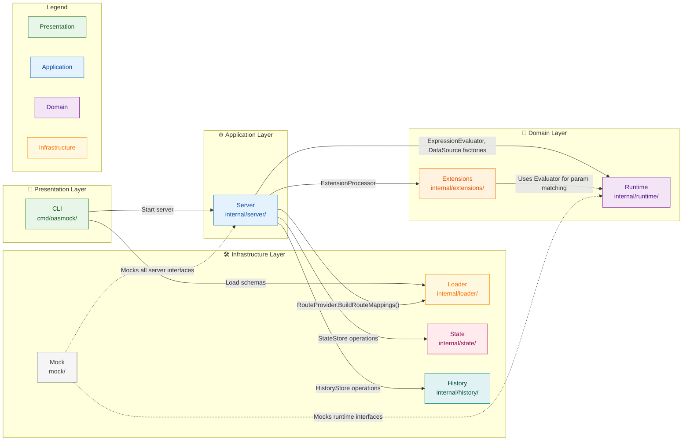
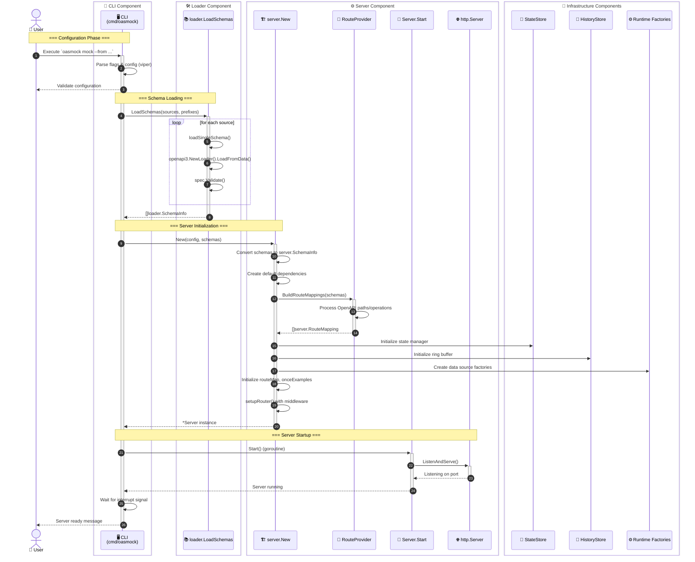
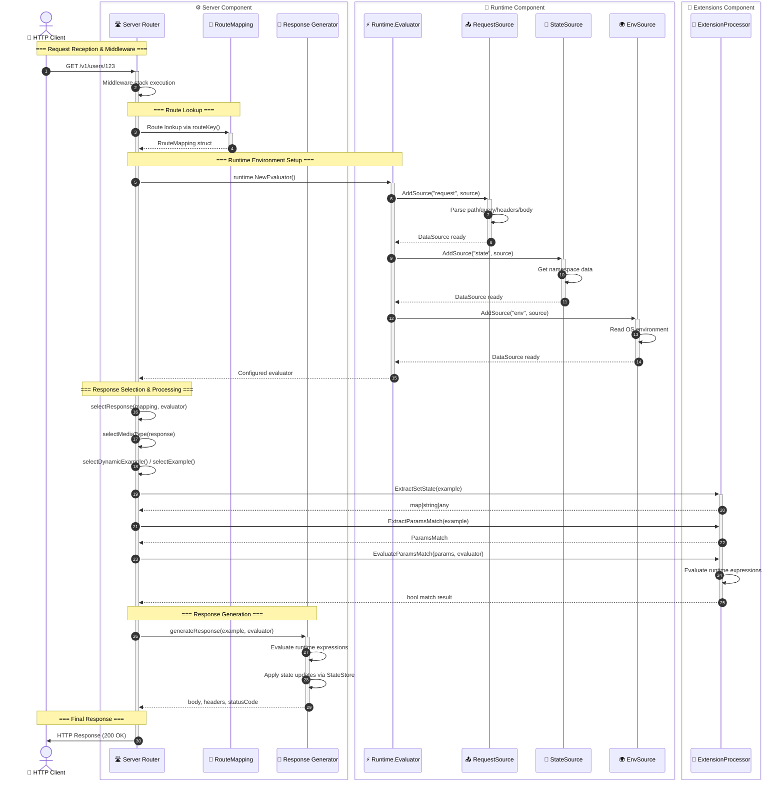
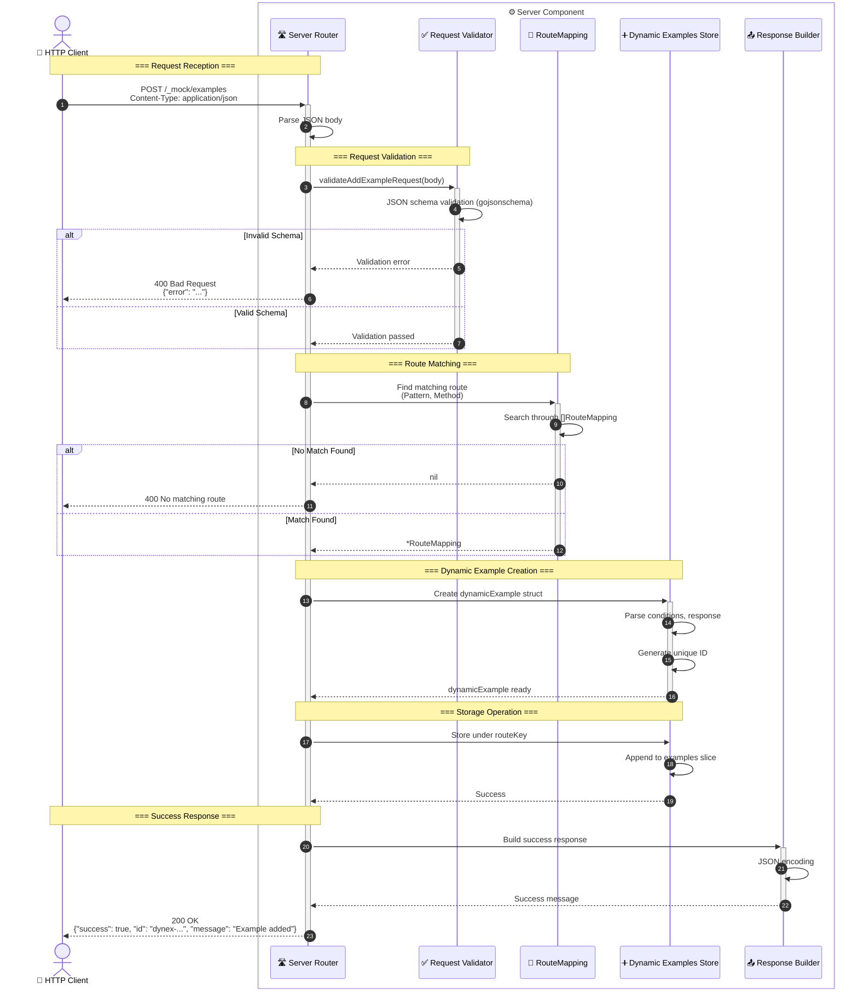

# OASMock Architecture Documentation

## Table of Contents
- [OASMock Architecture Documentation](#oasmock-architecture-documentation)
  - [Table of Contents](#table-of-contents)
  - [Overview](#overview)
    - [Diagram Conventions](#diagram-conventions)
  - [1. Component Architecture](#1-component-architecture)
  - [2. Component Details](#2-component-details)
    - [2.1 CLI Component (`cmd/oasmock/`)](#21-cli-component-cmdoasmock)
    - [2.2 Server Component (`internal/server/`)](#22-server-component-internalserver)
    - [2.3 Runtime Component (`internal/runtime/`)](#23-runtime-component-internalruntime)
    - [2.4 Extensions Component (`internal/extensions/`)](#24-extensions-component-internalextensions)
    - [2.5 Loader Component (`internal/loader/`)](#25-loader-component-internalloader)
    - [2.6 State Component (`internal/state/`)](#26-state-component-internalstate)
    - [2.7 History Component (`internal/history/`)](#27-history-component-internalhistory)
    - [2.8 Mock Component (`mock/`)](#28-mock-component-mock)
  - [3. Sequence Flows](#3-sequence-flows)
    - [3.1 CLI Initialization Flow](#31-cli-initialization-flow)
    - [3.2 HTTP Mock Request Flow](#32-http-mock-request-flow)
    - [3.3 Management API - Dynamic Example Addition](#33-management-api---dynamic-example-addition)
  - [4. Interface Definitions](#4-interface-definitions)
    - [4.1 Server Interfaces (`internal/server/interfaces.go`)](#41-server-interfaces-internalserverinterfacesgo)
    - [4.2 Runtime Interfaces (`internal/runtime/expression.go`)](#42-runtime-interfaces-internalruntimeexpressiongo)
    - [4.3 Extension Functions (`internal/extensions/extract.go`)](#43-extension-functions-internalextensionsextractgo)
  - [5. Data Flow Summary](#5-data-flow-summary)
    - [5.1 Initialization Flow](#51-initialization-flow)
    - [5.2 Request Handling Flow](#52-request-handling-flow)
    - [5.3 State Management Flow](#53-state-management-flow)
    - [5.4 History Tracking Flow](#54-history-tracking-flow)
    - [5.5 Dynamic Example Flow](#55-dynamic-example-flow)
  - [6. Design Patterns](#6-design-patterns)
    - [6.1 Dependency Injection](#61-dependency-injection)
    - [6.2 Adapter Pattern](#62-adapter-pattern)
    - [6.3 Factory Pattern](#63-factory-pattern)
    - [6.4 Strategy Pattern](#64-strategy-pattern)
    - [6.5 Observer Pattern](#65-observer-pattern)
  - [7. Testing Architecture](#7-testing-architecture)
    - [7.1 Mock Generation](#71-mock-generation)
    - [7.2 Unit Testing Strategy](#72-unit-testing-strategy)
    - [7.3 Integration Testing](#73-integration-testing)
  - [8. Extension Points](#8-extension-points)
    - [8.1 Custom Data Sources](#81-custom-data-sources)
    - [8.2 Custom Extension Processing](#82-custom-extension-processing)
    - [8.3 Custom State/History Stores](#83-custom-statehistory-stores)
  - [9. Performance Considerations](#9-performance-considerations)
    - [9.1 Memory Management](#91-memory-management)
    - [9.2 Concurrency](#92-concurrency)
    - [9.3 Runtime Evaluation](#93-runtime-evaluation)

## Overview

OASMock is an OpenAPI-based mock server with a modular architecture built in Go. This document describes the system's architecture, components, interfaces, and data flows using PlantUML diagrams for visual clarity.

### Diagram Conventions

All diagrams in this document use Mermaid syntax for broad compatibility across Git SaaS platforms and IDEs:

- **Node styling**: Nodes use `classDef` and `class` for consistent color-coded layers matching the four-layer architecture.
- **Sequence diagrams**: Use `box` for participant grouping, `autonumber` for step numbering, `alt/else` for branching, and `loop` for iterative processes.
- **Flowcharts**: Use `flowchart` with `subgraph` for structural grouping and `classDef` for color-coded node styles.
- **Activation/deactivation**: Sequence diagrams balance every activation with a corresponding deactivation to show processing scope.
- **Figure captions**: Diagrams include figure captions for reference numbering.
- **Unicode symbols**: Emojis and symbols (🎯, ⚙️, 🔧) provide visual semantics.

## 1. Component Architecture


```mermaid
flowchart LR
    subgraph PRES["🎯 Presentation Layer"]
        CLI["CLI<br/>cmd/oasmock/"]
    end
    subgraph APP["⚙️ Application Layer"]
        Server["Server<br/>internal/server/"]
    end
    subgraph DOM["🔧 Domain Layer"]
        Runtime["Runtime<br/>internal/runtime/"]
        Extensions["Extensions<br/>internal/extensions/"]
    end
    subgraph INF["🛠️ Infrastructure Layer"]
        Loader["Loader<br/>internal/loader/"]
        State["State<br/>internal/state/"]
        History["History<br/>internal/history/"]
        Mock["Mock<br/>mock/"]
    end
    subgraph LEGEND["Legend"]
        direction LR
        L1["Presentation"]
        L2["Application"]
        L3["Domain"]
        L4["Infrastructure"]
    end

    CLI -->|Load schemas| Loader
    CLI -->|Start server| Server

    Server -->|"RouteProvider.BuildRouteMappings()"| Loader
    Server -->|ExpressionEvaluator, DataSource factories| Runtime
    Server -->|ExtensionProcessor| Extensions
    Server -->|StateStore operations| State
    Server -->|HistoryStore operations| History

    Extensions -->|Uses Evaluator for param matching| Runtime

    Mock -.->|Mocks all server interfaces| Server
    Mock -.->|Mocks runtime interfaces| Runtime

    classDef green fill:#E8F5E9,stroke:#2E7D32,color:#1B5E20
    classDef blue fill:#E3F2FD,stroke:#1565C0,color:#0D47A1
    classDef purple fill:#F3E5F5,stroke:#7B1FA2,color:#4A148C
    classDef orange fill:#FFF3E0,stroke:#F57C00,color:#E65100
    classDef yellow fill:#FFF8E1,stroke:#FF8F00,color:#FF6F00
    classDef pink fill:#FFEBEE,stroke:#C2185B,color:#880E4F
    classDef teal fill:#E0F2F1,stroke:#00897B,color:#004D40
    classDef gray fill:#F5F5F5,stroke:#616161,color:#424242
    classDef leg fill:none,stroke:#ccc,color:#424242

    class CLI green
    class Server blue
    class Runtime purple
    class Extensions orange
    class Loader yellow
    class State pink
    class History teal
    class Mock gray
    class L1 green
    class L2 blue
    class L3 purple
    class L4 yellow
```

*Figure 1: High-level component architecture*

## 2. Component Details

### 2.1 CLI Component (`cmd/oasmock/`)
**Purpose**: Command-line interface using Cobra framework.
- **Key Files**:
  - `root.go` - Root command setup and error handling
  - `mock.go` - Main mock server command with configuration parsing
  - `main.go` - Application entry point
- **Responsibilities**:
  - Parse command-line flags and environment variables
  - Validate configuration (ports, paths, etc.)
  - Load OpenAPI schemas via Loader component
  - Initialize and start Server component
  - Handle interrupt signals for graceful shutdown
- **Dependencies**: Server, Loader

### 2.2 Server Component (`internal/server/`)
**Purpose**: Core HTTP server and component coordination.
- **Key Files**:
  - `server.go` - Main server implementation and HTTP handlers
  - `interfaces.go` - All public interfaces and dependency definitions
   - `server_management.go` - Management API endpoints
   - `server_example.go` - Example selection and response generation
   - `server_eval.go` - Runtime expression evaluation integration
   - `server_state.go` - State management helpers
   - `jsonrpc.go` - JSON-RPC handler (gateway requests)
   - `jsonrpc_protocol.go` - JSON-RPC 2.0 protocol parsing and error responses
   - `wrappers.go` - Adapter implementations
   - `adapters/` - Formal adapter layer for external components
- **Public Interfaces**:
  - `RouteProvider` - Builds route mappings from OpenAPI schemas
  - `StateStore` - Manages namespaced state with CRUD operations
  - `HistoryStore` - Stores request/response history records
  - `DataSource` - Generic data source for runtime expressions
  - `ExpressionEvaluator` - Evaluates runtime expressions (`{$request.path.id}`)
  - `ExtensionProcessor` - Processes OpenAPI extensions (`x-mock-*`)
- **Responsibilities**:
  - HTTP request routing using Chi router
  - Middleware stack (CORS, logging, delay, history)
  - Response generation and example selection
  - Runtime expression evaluation coordination
  - Extension processing and state updates
   - Management API endpoints (`/_mock/examples`, `/_mock/requests`)
   - RPC gateway dispatch (JSON-RPC to operation mapping via `x-rpc`)
- **Dependencies**: Loader, Runtime, Extensions, State, History

### 2.3 Runtime Component (`internal/runtime/`)
**Purpose**: Runtime expression evaluation engine.
- **Key Files**:
  - `expression.go` - Core expression parsing and evaluation
- **Public Interfaces**:
  - `DataSource` - `Get(path string) (any, bool)` interface
  - `Evaluator` - `AddSource(name, source)`, `Evaluate(expr) (any, error)`
- **Implementations**:
  - `RequestSource` - Access to HTTP request data (path params, query, headers, body, cookies)
  - `StateSource` - Access to namespaced server state
  - `EnvSource` - Access to environment variables
- **Responsibilities**:
  - Parse dot-separated paths with escape support (`path.id`, `query.page`)
  - Evaluate runtime expressions (`{$request.path.id | default:0}`)
  - Apply modifiers (`default:`, `getByPath:`, `toJWT`)
- **Dependencies**: None (self-contained)

### 2.4 Extensions Component (`internal/extensions/`)
**Purpose**: OpenAPI extension processing for advanced mock behavior.
- **Key Files**:
  - `extract.go` - Extension extraction utilities
  - `match.go` - Parameter matching with JSON schema validation
- **Supported Extensions**:
  - `x-mock-set-state` - Set server state after response
  - `x-mock-skip` - Skip example from selection
  - `x-mock-once` - Use example only once
  - `x-mock-match` - Conditional example selection (legacy alias: `x-mock-params-match`)
  - `x-mock-headers` - Custom response headers
- **Functions**:
  - `ExtractSetState()`, `ExtractParamsMatch()`, `ExtractHeaders()`
  - `EvaluateParamsMatch()` - Uses Runtime.Evaluator for expression evaluation
  - `ExtractSkip()`, `ExtractOnce()`
- **Responsibilities**:
  - Extract extension values from OpenAPI examples
  - Validate JSON schemas for parameter matching
  - Evaluate runtime expressions in match conditions
- **Dependencies**: Runtime (for expression evaluation)

### 2.5 Loader Component (`internal/loader/`)
**Purpose**: OpenAPI schema loading and route mapping.
- **Key Files**:
  - `schema.go` - Schema loading and validation
  - `router.go` - Route mapping construction
- **Key Types**:
  - `SchemaInfo` - Loaded OpenAPI spec with prefix
  - `RouteMapping` - Route information for server routing
- **Functions**:
  - `LoadSchemas(sources, prefixes) ([]SchemaInfo, error)` - Load multiple schemas
  - `loadSingleSchema(path) (*openapi3.T, error)` - Load and validate single schema
  - `OpenAPIPatternToChi(pattern) string` - Convert OpenAPI patterns to Chi format
- **Responsibilities**:
  - Load OpenAPI YAML/JSON files from disk
  - Validate OpenAPI 3.0 schemas
  - Build route mappings for server registration
  - Handle path prefixing for multi-schema scenarios
- **Dependencies**: None (uses external `kin-openapi` library)

### 2.6 State Component (`internal/state/`)
**Purpose**: Thread-safe, namespaced key-value state management.
- **Key Files**:
  - `state.go` - Thread-safe state manager implementation
- **Key Type**:
  - `Manager` - Main state manager with sync.RWMutex
- **Operations**:
  - `Get(namespace, key) (any, bool)` - Retrieve value
  - `Set(namespace, key, value)` - Set key-value pair
  - `Increment(namespace, key, delta) (float64, error)` - Atomic increment
  - `Delete(namespace, key)` - Remove key
  - `GetNamespace(namespace) map[string]any` - Get all namespace data
  - `GetAll() map[string]map[string]any` - Get all state (debug)
- **Responsibilities**:
  - Thread-safe concurrent access management
  - Namespace isolation for multi-schema support
  - JSON-serializable value storage
- **Dependencies**: None (self-contained)

### 2.7 History Component (`internal/history/`)
**Purpose**: Request/response history storage with fixed-size ring buffer.
- **Key Files**:
  - `history.go` - Ring buffer implementation
- **Key Types**:
  - `RequestRecord` - HTTP request details (method, path, headers, body)
  - `ResponseRecord` - HTTP response details (status, headers, body, duration)
  - `RingBuffer` - Fixed-size circular buffer
- **Operations**:
  - `Add(record)` - Add request record (overwrites oldest when full)
  - `GetAll() []RequestRecord` - Get all records (chronological)
  - `Count() int` - Current record count
  - `Capacity() int` - Buffer capacity
  - `Clear()` - Remove all records
- **Responsibilities**:
  - Efficient storage with memory bounds
  - Chronological record retrieval
  - Thread-safe concurrent access
- **Dependencies**: None (self-contained)

### 2.8 RPC Protocol Subsystem (`internal/server/` and `internal/loader/`)
**Purpose**: JSON-RPC 2.0 gateway enabling procedure dispatch by body field instead of URL path.
- **Key Files**:
  - `internal/server/jsonrpc.go` - RPC handler (batch support, notification handling)
  - `internal/server/jsonrpc_protocol.go` - JSON-RPC 2.0 protocol (parse, error responses)
  - `internal/loader/rpc.go` - `x-rpc` extension parsing
  - `internal/loader/rpc_config.go` - RPC configuration types
- **Key Interfaces**:
  - `RpcProtocol` - `ParseBody()`, `ErrorResponse()`, `ContentType()`
  - `RpcCall` - Parsed call representation (Procedure, ID, Raw body)
- **Responsibilities**:
  - Parse batch and single JSON-RPC request bodies
  - Dispatch each call through the example selection pipeline
  - Handle notifications (no response entry)
  - Generate standard JSON-RPC 2.0 error responses
- **Dependencies**: Extensions (for x-mock-* processing), Runtime (expression evaluation)

### 2.9 Mock Component (`mock/`)
**Purpose**: Generated interface mocks for unit testing.
- **Packages**:
  - `mock_runtime` - Mocks for runtime interfaces (`DataSource`, `Evaluator`)
  - `mock_server` - Mocks for server interfaces (`RouteProvider`, `StateStore`, etc.)
- **Generation**:
  - Generated via `go:generate mockgen` directives
  - Separate packages for importability in tests
  - `_mock.go` suffix (not `_test.go`)
- **Responsibilities**:
  - Provide mock implementations for interface testing
  - Enable clean unit testing with dependency injection
  - Support test-driven development
- **Dependencies**: All interface packages (generated from them)

## 3. Sequence Flows

### 3.1 CLI Initialization Flow


```mermaid
sequenceDiagram
    autonumber

    actor User as 👤 User
    box 🎯 CLI Component
        participant CLI as 🖥️ CLI<br/>(cmd/oasmock)
    end
    box 🛠️ Loader Component
        participant Loader as 📚 loader.LoadSchemas
    end
    box ⚙️ Server Component
        participant ServerNew as 🏗️ server.New
        participant RouteProvider as 🔧 RouteProvider
        participant ServerStart as 🚀 Server.Start
        participant HTTPServer as 🌐 http.Server
    end
    box 💾 Infrastructure Components
        participant StateStore as 💾 StateStore
        participant HistoryStore as 📜 HistoryStore
        participant RuntimeFactories as ⚙️ Runtime Factories
    end

    Note over User,CLI: === Configuration Phase ===
    User->>+CLI: Execute `oasmock mock --from ...`
    CLI->>CLI: Parse flags & config (viper)
    CLI-->>User: Validate configuration

    Note over CLI,Loader: === Schema Loading ===
    CLI->>+Loader: LoadSchemas(sources, prefixes)
    loop for each source
        Loader->>Loader: loadSingleSchema()
        Loader->>Loader: openapi3.NewLoader().LoadFromData()
        Loader->>Loader: spec.Validate()
    end
    Loader-->>-CLI: []loader.SchemaInfo

    Note over CLI,ServerNew: === Server Initialization ===
    CLI->>+ServerNew: New(config, schemas)
    ServerNew->>ServerNew: Convert schemas to server.SchemaInfo
    ServerNew->>ServerNew: Create default dependencies
    ServerNew->>+RouteProvider: BuildRouteMappings(schemas)
    RouteProvider->>RouteProvider: Process OpenAPI paths/operations
    RouteProvider-->>-ServerNew: []server.RouteMapping
    ServerNew->>StateStore: Initialize state manager
    ServerNew->>HistoryStore: Initialize ring buffer
    ServerNew->>RuntimeFactories: Create data source factories
    ServerNew->>ServerNew: Initialize routeMap, onceExamples
    ServerNew->>ServerNew: setupRouter() with middleware
    ServerNew-->>-CLI: *Server instance

    Note over CLI,HTTPServer: === Server Startup ===
    CLI->>+ServerStart: Start() (goroutine)
    ServerStart->>+HTTPServer: ListenAndServe()
    HTTPServer-->>-ServerStart: Listening on port
    ServerStart-->>-CLI: Server running
    CLI->>CLI: Wait for interrupt signal
    CLI-->>-User: Server ready message
```

*Figure 2: CLI startup sequence*

**Description**:
1. **User Interaction**: CLI component parses command-line arguments and validates configuration
2. **Schema Loading**: Loader component loads and validates OpenAPI schemas from files
3. **Server Creation**: Server component initializes with dependencies including RouteProvider for route mapping
4. **Dependency Setup**: Infrastructure components (StateStore, HistoryStore, RuntimeFactories) are initialized
5. **Server Startup**: HTTP server starts listening on configured port

### 3.2 HTTP Mock Request Flow


```mermaid
sequenceDiagram
    autonumber

    actor Client as 👤 HTTP Client
    box ⚙️ Server Component
        participant Router as 🛣️ Server Router
        participant Mapping as 📍 RouteMapping
        participant ResponseGen as 📄 Response Generator
    end
    box 🔧 Runtime Component
        participant Evaluator as ⚡ Runtime.Evaluator
        participant RequestSource as 📤 RequestSource
        participant StateSource as 💾 StateSource
        participant EnvSource as 🌍 EnvSource
    end
    box 🔌 Extensions Component
        participant ExtProcessor as 🔌 ExtensionProcessor
    end

    Note over Client,Router: === Request Reception & Middleware ===
    Client->>+Router: GET /v1/users/123
    Router->>Router: Middleware stack execution

    Note over Router,Mapping: === Route Lookup ===
    Router->>+Mapping: Route lookup via routeKey()
    Mapping-->>-Router: RouteMapping struct

    Note over Router,Evaluator: === Runtime Environment Setup ===
    Router->>+Evaluator: runtime.NewEvaluator()
    Evaluator->>+RequestSource: AddSource("request", source)
    RequestSource->>RequestSource: Parse path/query/headers/body
    RequestSource-->>-Evaluator: DataSource ready
    Evaluator->>+StateSource: AddSource("state", source)
    StateSource->>StateSource: Get namespace data
    StateSource-->>-Evaluator: DataSource ready
    Evaluator->>+EnvSource: AddSource("env", source)
    EnvSource->>EnvSource: Read OS environment
    EnvSource-->>-Evaluator: DataSource ready
    Evaluator-->>-Router: Configured evaluator

    Note over Router,Router: === Response Selection & Processing ===
    Router->>Router: selectResponse(mapping, evaluator)
    Router->>Router: selectMediaType(response)
    Router->>Router: selectDynamicExample() / selectExample()

    Router->>+ExtProcessor: ExtractSetState(example)
    ExtProcessor-->>Router: map[string]any
    Router->>ExtProcessor: ExtractParamsMatch(example)
    ExtProcessor-->>Router: ParamsMatch
    Router->>ExtProcessor: EvaluateParamsMatch(params, evaluator)
    ExtProcessor->>ExtProcessor: Evaluate runtime expressions
    ExtProcessor-->>-Router: bool match result

    Note over Router,ResponseGen: === Response Generation ===
    Router->>+ResponseGen: generateResponse(example, evaluator)
    ResponseGen->>ResponseGen: Evaluate runtime expressions
    ResponseGen->>ResponseGen: Apply state updates via StateStore
    ResponseGen-->>-Router: body, headers, statusCode

    Note over Client,Router: === Final Response ===
    Router->>Client: HTTP Response (200 OK)
    deactivate Router
```

*Figure 3: HTTP request handling sequence*

**Description**:
1. **Request Reception**: Server component receives HTTP request and processes middleware
2. **Route Resolution**: RouteMapping lookup finds matching OpenAPI operation
3. **Runtime Setup**: Runtime component creates evaluator with data sources (Request, State, Env)
4. **Response Selection**: Server selects appropriate response based on operation and examples
5. **Extension Processing**: Extensions component processes x-mock-* extensions and evaluates conditions
6. **Response Generation**: Final response generated with evaluated runtime expressions

### 3.3 Management API - Dynamic Example Addition


```mermaid
sequenceDiagram
    autonumber

    actor Client as 👤 HTTP Client
    box ⚙️ Server Component
        participant Router as 🛣️ Server Router
        participant Validator as ✅ Request Validator
        participant Mapping as 📍 RouteMapping
        participant DynStore as ➕ Dynamic Examples Store
        participant ResponseBuilder as 📤 Response Builder
    end

    Note over Client,Router: === Request Reception ===
    Client->>+Router: POST /_mock/examples<br/>Content-Type: application/json
    Router->>Router: Parse JSON body

    Note over Router,Validator: === Request Validation ===
    Router->>+Validator: validateAddExampleRequest(body)
    Validator->>Validator: JSON schema validation (gojsonschema)
    alt Invalid Schema
        Validator-->>Router: Validation error
        Router-->>Client: 400 Bad Request<br/>{"error": "..."}
    else Valid Schema
        Validator-->>-Router: Validation passed
    end

    Note over Router,Mapping: === Route Matching ===
    Router->>+Mapping: Find matching route<br/>(Pattern, Method)
    Mapping->>Mapping: Search through []RouteMapping
    alt No Match Found
        Mapping-->>Router: nil
        Router-->>Client: 400 No matching route
    else Match Found
        Mapping-->>-Router: *RouteMapping
    end

    Note over Router,DynStore: === Dynamic Example Creation ===
    Router->>+DynStore: Create dynamicExample struct
    DynStore->>DynStore: Parse conditions, response
    DynStore->>DynStore: Generate unique ID
    DynStore-->>-Router: dynamicExample ready

    Note over Router,DynStore: === Storage Operation ===
    Router->>DynStore: Store under routeKey
    DynStore->>DynStore: Append to examples slice
    DynStore-->>Router: Success

    Note over Client,Router: === Success Response ===
    Router->>+ResponseBuilder: Build success response
    ResponseBuilder->>ResponseBuilder: JSON encoding
    ResponseBuilder-->>-Router: Success message
    Router-->>Client: 200 OK<br/>{"success": true, "id": "dynex-...", "message": "Example added"}
    deactivate Router
```

*Figure 4: Dynamic example addition via management API*

**Description**:
1. **API Request**: Client sends POST request to management API endpoint
2. **Request Validation**: Server validates JSON payload against schema
3. **Route Matching**: Find existing RouteMapping for the specified path/method
4. **Example Creation**: Create dynamic example with conditions and response
5. **Storage**: Store example in Server's dynamic examples map
6. **Response**: Return success message with generated example ID

## 4. Interface Definitions

### 4.1 Server Interfaces (`internal/server/interfaces.go`)

```go
// RouteProvider builds route mappings from OpenAPI schemas
type RouteProvider interface {
    BuildRouteMappings(schemas []SchemaInfo) ([]RouteMapping, error)
}

// StateStore manages state per namespace
type StateStore interface {
    Get(namespace, key string) (any, bool)
    Set(namespace, key string, value any)
    Increment(namespace, key string, delta float64) (float64, error)
    Delete(namespace, key string)
    GetNamespace(namespace string) map[string]any
    GetAll() map[string]map[string]any
}

// HistoryStore stores request history records
type HistoryStore interface {
    Add(record RequestRecord)
    GetAll() []RequestRecord
    Count() int
    Capacity() int
    Clear()
}

// DataSource represents a source of data for runtime expressions
type DataSource interface {
    Get(path string) (any, bool)
}

// ExpressionEvaluator evaluates runtime expressions
type ExpressionEvaluator interface {
    AddSource(name string, source DataSource)
    Evaluate(expr string) (any, error)
}

// ExtensionProcessor processes OpenAPI extensions
type ExtensionProcessor interface {
    ExtractSetState(example *openapi3.Example) (map[string]any, bool)
    ExtractSkip(example *openapi3.Example) bool
    ExtractOnce(example *openapi3.Example) bool
    ExtractParamsMatch(example *openapi3.Example) (map[string]any, bool)
    EvaluateParamsMatch(params map[string]any, eval ExpressionEvaluator) (bool, error)
    ExtractHeaders(example *openapi3.Example) (map[string]any, bool)
}

// Dependencies holds all dependencies for the Server
type Dependencies struct {
    RouteProvider        RouteProvider
    StateStore           StateStore
    HistoryStore         HistoryStore
    RequestSourceFactory RequestSourceFactory
    StateSourceFactory   StateSourceFactory
    EnvSourceFactory     EnvSourceFactory
    ExpressionEvaluator  ExpressionEvaluator
    ExtensionProcessor   ExtensionProcessor
}
```

### 4.2 Runtime Interfaces (`internal/runtime/expression.go`)

```go
// DataSource represents a source of data for runtime expressions
type DataSource interface {
    Get(path string) (any, bool)
}

// Evaluator evaluates runtime expressions using available data sources
type Evaluator interface {
    AddSource(name string, source DataSource)
    Evaluate(expr string) (any, error)
}

// RequestSource provides access to request data
type RequestSource struct {
    PathParams  map[string]string
    QueryParams map[string][]string
    Headers     map[string][]string
    Body        any
    Cookies     map[string]string
}

// StateSource provides access to server state
type StateSource struct {
    Data map[string]any
}

// EnvSource provides access to environment variables
type EnvSource struct {
    Env map[string]string
}
```

### 4.3 Extension Functions (`internal/extensions/extract.go`)

```go
// ExtractParamsMatch extracts the x-mock-match (or x-mock-params-match) extension from an example.
func ExtractParamsMatch(ex *openapi3.Example) (ParamsMatch, bool)

// ExtractSkip extracts x-mock-skip extension
func ExtractSkip(ex *openapi3.Example) bool

// ExtractOnce extracts x-mock-once extension
func ExtractOnce(ex *openapi3.Example) bool

// ExtractSetState extracts x-mock-set-state extension
func ExtractSetState(ex *openapi3.Example) (map[string]any, bool)

// ExtractHeaders extracts x-mock-headers extension
func ExtractHeaders(ex *openapi3.Example) (map[string]any, bool)

// EvaluateParamsMatch evaluates parameter matching conditions.
// The ParamsMatch type is an alias for map[string]any (defined in extensions/match.go).
func EvaluateParamsMatch(pm ParamsMatch, eval runtime.Evaluator) (bool, error)
```

## 5. Data Flow Summary

### 5.1 Initialization Flow
```
User → CLI → Load schemas → Build route mappings → Create Server → Start HTTP server
```

### 5.2 Request Handling Flow
```
HTTP Request → Server Router → RouteMapping lookup → Build data sources → 
Evaluate expressions → Select response/example → Process extensions → 
Generate response → Update state/history → Return HTTP response
```

### 5.3 State Management Flow
```
x-mock-set-state extension → ExtensionProcessor → StateStore operations
```

### 5.4 History Tracking Flow
```
Request/Response → HistoryStore (RingBuffer) → Management API queries
```

### 5.5 Dynamic Example Flow
```
Management API request → Validation → Route matching → Create dynamic example → 
Store in Server → Future requests can use dynamic example
```

### 5.6 JSON-RPC Flow
```
JSON-RPC request → RpcProtocol.ParseBody → Per-call dispatch (batch) →
RouteMapping lookup by procedure name → Expression evaluation →
Example selection → State / history / response collection
```

## 6. Design Patterns

### 6.1 Dependency Injection
- Server accepts `Dependencies` struct with all interfaces
- Enables testability and flexibility

### 6.2 Adapter Pattern
- Wrappers convert concrete types to interface implementations
- `wrappers.go` adapts `state.Manager` to `StateStore` interface

### 6.3 Factory Pattern
- Factories create data source instances (`RequestSourceFactory`, etc.)
- Enables runtime creation of data sources

### 6.4 Strategy Pattern
- Different data sources and evaluators can be plugged in
- Extension processing strategies for different x-mock-* extensions

### 6.5 History Tracking / State Exposure
- History ring buffer tracks all requests/responses for later inspection
- State is queryable through management API endpoints
- Middleware-based recording pattern decouples tracking from business logic

## 7. Testing Architecture

### 7.1 Mock Generation
- Generated via `go:generate mockgen` directives
- Separate `mock/` directory with package suffixes
- `_mock.go` files (not `_test.go`) for importability

### 7.2 Unit Testing Strategy
- Test interfaces with generated mocks
- Dependency injection enables isolated testing
- Example: Test `RouteProvider` without actual HTTP server

### 7.3 Integration Testing
- End-to-end tests in `test/` directory
- Test complete request/response cycles
- Management API integration tests

## 8. Extension Points

### 8.1 Custom Data Sources
- Implement `DataSource` interface for custom data access
- Register via `Evaluator.AddSource()`

### 8.2 Custom Extension Processing
- Implement `ExtensionProcessor` interface
- Add support for new x-mock-* extensions

### 8.3 Custom State/History Stores
- Implement `StateStore` or `HistoryStore` interfaces
- Replace default implementations via `Dependencies`

### 8.4 Custom RPC Protocols
- Implement `RpcProtocol` interface (`ParseBody`, `ErrorResponse`, `ContentType`)
- Configure via `x-rpc.protocolType` in the OpenAPI spec

## 9. Performance Considerations

### 9.1 Memory Management
- Ring buffer for history prevents unbounded growth
- State per namespace enables memory isolation
- Schema caching in loader reduces file I/O

### 9.2 Concurrency
- Thread-safe state manager with `sync.RWMutex`
- Concurrent request handling via Go HTTP server
- Read/write locks for efficient concurrent access

### 9.3 Runtime Evaluation
- Expression caching could be added for performance
- Simple path parsing algorithm with O(n) complexity
