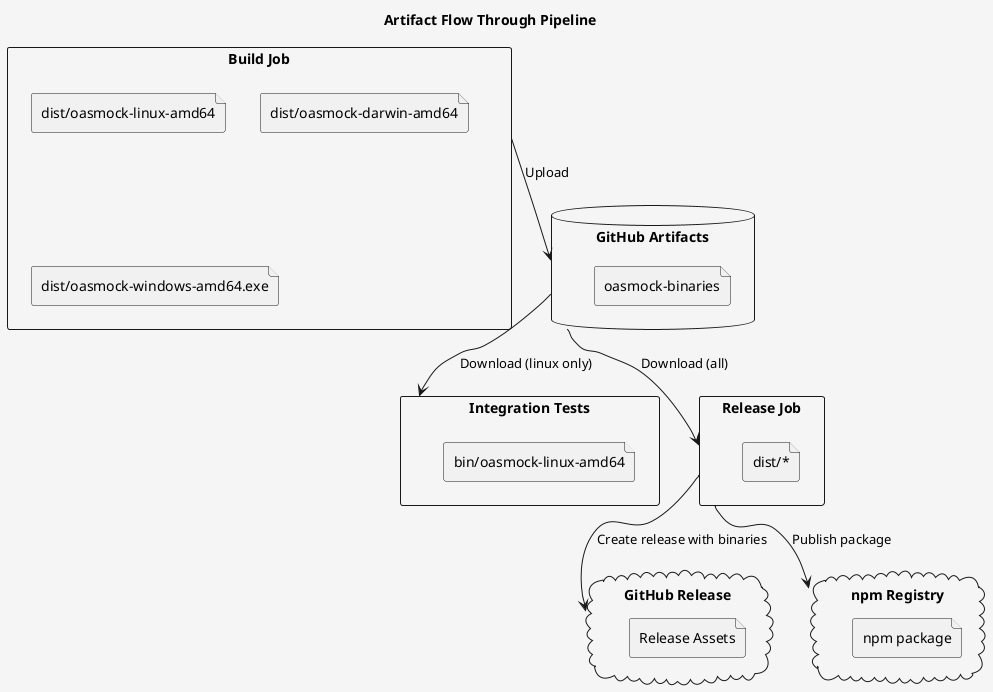

# CI/CD Pipeline

## Overview

The OASMock CI/CD pipeline is a unified GitHub Actions workflow that ensures code quality, test coverage, and reliable releases. The pipeline follows the principle "test what you ship" by building binaries once and reusing the exact same binaries through integration testing and release.

## Key Design Principles

1. **Single Build Artifact**: Binaries are built once, stored as artifacts, and reused across jobs
2. **Parallel Fast Checks**: Unit tests and spec coverage checks run in parallel for faster feedback
3. **Integration Testing Against Built Binary**: Integration tests run against the actual binary that will be shipped
4. **Same Binary for Release**: The release process uses the exact same binaries that passed integration tests
5. **Cross-Platform Support**: Builds for Linux, macOS, and Windows

## Pipeline Architecture

```plantuml
@startuml
title OASMock CI/CD Pipeline
skinparam backgroundColor #F5F5F5
skinparam activityBackgroundColor #FFFFFF
skinparam activityBorderColor #333333
skinparam activityFontSize 14
skinparam arrowColor #333333

start

partition "Parallel Fast Checks" {
  :Unit Tests & Coverage;
  :Spec Coverage Check;
}

partition "Build & Package" {
  :Build Binaries;
  note right
    Cross-compile for:
    - Linux (amd64)
    - macOS (amd64)
    - Windows (amd64)
  end note
  :Upload Artifacts;
}

partition "Integration Testing" {
  :Download Linux Binary;
  :Run Integration Tests;
}

partition "Release (Tags Only)" {
  :Create GitHub Release;
  :Publish npm Package;
}

stop

' Dependency arrows
Unit Tests & Coverage --> Build Binaries
Spec Coverage Check --> Build Binaries
Build Binaries --> Upload Artifacts
Upload Artifacts --> Download Linux Binary
Download Linux Binary --> Run Integration Tests
Run Integration Tests --> Create GitHub Release
Create GitHub Release --> Publish npm Package

@enduml
```

## Trigger Events

| Event | Description | Jobs Executed |
|-------|-------------|---------------|
| `push` to `main` | Code changes to main branch | All jobs except release |
| `pull_request` to `main` | Pull request creation/update | All jobs except release |
| `push` of `v*` tag | Version tag push (e.g., v1.0.0) | All jobs including release |

## Job Details

### 1. Unit Tests & Coverage

**Job Name:** `unit-tests`  
**Runs On:** `ubuntu-latest`  
**Purpose:** Validate code quality and test coverage

**Steps:**
1. Checkout code
2. Set up Go 1.23
3. Install dependencies (`go mod tidy`)
4. Run unit tests with coverage check (`make coverage-unit`)
5. Run linter (`golangci-lint`)

**Coverage Requirement:** Minimum 70% code coverage (current baseline)

### 2. Spec Coverage Check

**Job Name:** `spec-coverage`  
**Runs On:** `ubuntu-latest`  
**Purpose:** Ensure all requirement scenarios are covered by tests

**Steps:**
1. Checkout code with full history (for spec analysis)
2. Set up Python
3. Run spec coverage analysis (`scripts/analyze_scenario_coverage.py`)
4. Upload coverage report as artifact

**Coverage Requirement:** 100% scenario coverage (0.999 threshold)

### 3. Build Binaries

**Job Name:** `build`  
**Runs On:** `ubuntu-latest`  
**Needs:** `unit-tests`, `spec-coverage`  
**Purpose:** Cross-compile binaries for all target platforms

**Steps:**
1. Checkout code
2. Set up Go 1.23
3. Extract version from git tag or describe
4. Cross-compile with version embedded:
   - `oasmock-linux-amd64` (Linux)
   - `oasmock-darwin-amd64` (macOS)
   - `oasmock-windows-amd64.exe` (Windows)
5. Upload binaries as GitHub Actions artifact

**Outputs:** `version` (extracted from git)

### 4. Integration Tests

**Job Name:** `integration-tests`  
**Runs On:** `ubuntu-latest`  
**Needs:** `build`  
**Purpose:** Test the built binary as a complete system

**Environment:** `OASMOCK_TEST_SKIP_BUILD=true` (use pre-built binary)

**Steps:**
1. Checkout code
2. Set up Go 1.23
3. Download binaries artifact to `bin/` directory
4. Make Linux binary executable (`chmod +x`)
5. Create symlink `bin/oasmock` → `bin/oasmock-linux-amd64`
6. Run integration tests (`go test ./test/...`)

**Note:** Tests run against the exact binary that will be released

### 5. Create Release

**Job Name:** `release`  
**Runs On:** `ubuntu-latest`  
**Needs:** `integration-tests`  
**When:** Only on tag pushes (`v*`)  
**Permissions:** `contents: write`, `packages: write`  
**Purpose:** Create or update GitHub release and publish npm package

**Steps:**
1. Checkout code with full history
2. Set up Go 1.23
3. Download binaries artifact
4. Create or update GitHub release with all three binaries (handles auto-created drafts)
5. Set up Node.js for npm publishing
6. Create npm package structure:
   - Copy binaries to `npm-package/bin/`
   - Create `install.js` script for platform detection
   - Create `package.json` with version from tag
7. Publish to npm registry

**Secrets Required:**
- `GITHUB_TOKEN` (auto-provided by GitHub Actions)
- `NPM_TOKEN` (stored in repository secrets)

## Artifact Flow



## Environment Variables

| Variable | Purpose | Default |
|----------|---------|---------|
| `OASMOCK_TEST_SKIP_BUILD` | Skip binary build in integration tests | `false` |
| `GITHUB_TOKEN` | GitHub API authentication | Auto-provided |
| `NPM_TOKEN` | npm registry authentication | Required for releases |

## Makefile Targets

The pipeline uses these Makefile targets:

| Target | Description | Used By |
|--------|-------------|---------|
| `coverage-unit` | Run unit tests with coverage check | `unit-tests` job |
| `spec-coverage` | Check requirement scenario coverage | `spec-coverage` job (via script) |
| `build-cross` | Cross-compile for all platforms | Not used directly (CI does cross-compile) |
| `test-integration` | Run integration tests | `integration-tests` job |

## Quality Gates

1. **Unit Test Coverage**: Must meet or exceed 70% (baseline)
2. **Spec Coverage**: Must be 100% (all requirement scenarios covered)
3. **Linting**: Must pass `golangci-lint` checks
4. **Integration Tests**: All integration tests must pass
5. **Binary Compatibility**: Binaries must pass integration tests

## Failure Handling

- If unit tests or spec coverage fail, build job is skipped
- If build fails, integration tests are skipped
- If integration tests fail, release is skipped
- Release only runs on successful integration tests and tag pushes

## Maintenance

### Adding New Platforms
To add support for a new platform (e.g., ARM64):

1. Update `build` job in `.github/workflows/ci.yml`:
   ```yaml
   GOOS=linux GOARCH=arm64 go build -o dist/oasmock-linux-arm64 ./cmd/oasmock
   ```
2. Update `install.js` in release job to handle new platform
3. Update npm package.json `os` and `cpu` fields if needed

### Changing Coverage Thresholds
- Unit test coverage: Update `scripts/check-coverage.sh` call in `unit-tests` job
- Spec coverage: Update threshold in `spec-coverage` job (currently 0.999)

### Debugging
- Artifacts are retained for 7 days
- Coverage reports are uploaded as artifacts
- Logs are available in GitHub Actions interface

## Related Files

- `.github/workflows/ci.yml` - Main pipeline definition
- `Makefile` - Build and test targets
- `scripts/check-coverage.sh` - Coverage check script
- `scripts/analyze_scenario_coverage.py` - Spec coverage analysis
- `test/_shared/binhelper/` - Binary helper for integration tests

## Migration from Previous Workflows

This unified pipeline replaces:
- `.github/workflows/go.yml` (build and test)
- `.github/workflows/release.yml` (release)

The new pipeline provides:
- Better parallelism (unit tests + spec coverage)
- Single build artifact reused across jobs
- Consistent "test what you ship" approach
- Simplified maintenance with single workflow file