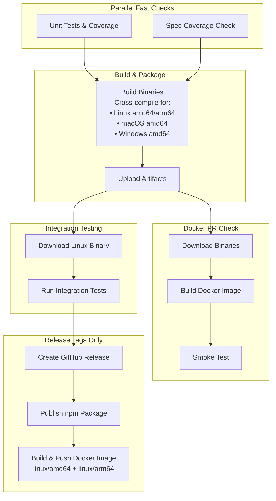
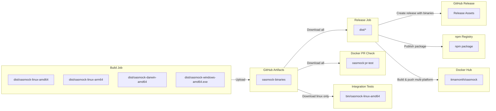

# CI/CD Pipeline

## Overview

The OASMock CI/CD pipeline is a unified GitHub Actions workflow that ensures code quality, test coverage, and reliable releases. The pipeline follows the principle "test what you ship" by building binaries once and reusing the exact same binaries through integration testing and release.

## Key Design Principles

1. **Single Build Artifact**: Binaries are built once, stored as artifacts, and reused across jobs
2. **Parallel Fast Checks**: Unit tests and spec coverage checks run in parallel for faster feedback
3. **Integration Testing Against Built Binary**: Integration tests run against the actual binary that will be shipped
4. **Same Binary for Release**: The release process uses the exact same binaries that passed integration tests
5. **Cross-Platform Support**: Builds for Linux, macOS, and Windows

## Pipeline Architecture


```mermaid
flowchart TD
    subgraph P1["Parallel Fast Checks"]
        direction LR
        A[Unit Tests & Coverage]
        B[Spec Coverage Check]
    end

    subgraph P2["Build & Package"]
        C[Build Binaries<br/>Cross-compile for:<br/>• Linux amd64/arm64<br/>• macOS amd64<br/>• Windows amd64]
        D[Upload Artifacts]
    end

    subgraph P3["Integration Testing"]
        E[Download Linux Binary]
        F[Run Integration Tests]
    end

    subgraph P3b["Docker PR Check"]
        G2[Download Binaries]
        H2[Build Docker Image]
        I2[Smoke Test]
    end

    subgraph P4["Release Tags Only"]
        G[Create GitHub Release]
        H[Publish npm Package]
        J[Build & Push Docker Image<br/>linux/amd64 + linux/arm64]
    end

    A --> C
    B --> C
    C --> D
    D --> E
    E --> F
    D --> G2
    G2 --> H2
    H2 --> I2
    F --> G
    G --> H
    H --> J
```

## Trigger Events

| Event | Description | Jobs Executed |
|-------|-------------|---------------|
| `push` to `main` | Code changes to main branch | All jobs except release and docker-build |
| `pull_request` to `main` | Pull request creation/update | All jobs except release |
| `push` of `v*` tag | Version tag push (e.g., v1.0.0) | All jobs including release |

## Job Details

### 1. Unit Tests & Coverage

**Job Name:** `unit-tests`  
**Runs On:** `ubuntu-latest`  
**Purpose:** Validate code quality and test coverage

**Steps:**
1. Checkout code
2. Set up Go 1.23
3. Install dependencies (`go mod tidy`)
4. Run unit tests with coverage check (`make coverage-unit`)
5. Run linter (`golangci-lint`)

**Coverage Requirement:** Minimum 70% code coverage (current baseline)

### 2. Spec Coverage Check

**Job Name:** `spec-coverage`  
**Runs On:** `ubuntu-latest`  
**Purpose:** Ensure all requirement scenarios are covered by tests

**Steps:**
1. Checkout code with full history (for spec analysis)
2. Set up Python
3. Run spec coverage analysis (`scripts/analyze_scenario_coverage.py`)
4. Upload coverage report as artifact

**Coverage Requirement:** 100% scenario coverage (0.999 threshold)

### 3. Build Binaries

**Job Name:** `build`  
**Runs On:** `ubuntu-latest`  
**Needs:** `unit-tests`, `spec-coverage`  
**Purpose:** Cross-compile binaries for all target platforms

**Steps:**
1. Checkout code
2. Set up Go 1.23
3. Extract version from git tag or describe
4. Cross-compile with version embedded:
   - `oasmock-linux-amd64` (Linux x86_64)
   - `oasmock-linux-arm64` (Linux arm64)
   - `oasmock-darwin-amd64` (macOS x86_64)
   - `oasmock-windows-amd64.exe` (Windows x86_64)
5. Upload binaries as GitHub Actions artifact

**Outputs:** `version` (extracted from git)

### 4. Integration Tests

**Job Name:** `integration-tests`  
**Runs On:** `ubuntu-latest`  
**Needs:** `build`  
**Purpose:** Test the built binary as a complete system

**Environment:** `OASMOCK_TEST_SKIP_BUILD=true` (use pre-built binary)

**Steps:**
1. Checkout code
2. Set up Go 1.23
3. Download binaries artifact to `bin/` directory
4. Make Linux binary executable (`chmod +x`)
5. Create symlink `bin/oasmock` → `bin/oasmock-linux-amd64`
6. Run integration tests (`go test ./test/...`)

**Note:** Tests run against the exact binary that will be released

### 5. Docker Image Build (PR Check)

**Job Name:** `docker-build`  
**Runs On:** `ubuntu-latest`  
**Needs:** `build`  
**When:** Pull requests to `main` only  
**Purpose:** Verify the Dockerfile builds successfully and the packaged binary starts

**Steps:**
1. Checkout code
2. Download binaries artifact into the build context root
3. Build the Docker image (`docker build -t oasmock:pr-test .`)
4. Smoke test the image (`docker run --rm oasmock:pr-test --version`)

**Note:** This job is build-only — no image is pushed to any registry.

### 6. Create Release

**Job Name:** `release`  
**Runs On:** `ubuntu-latest`  
**Needs:** `integration-tests`  
**When:** Only on tag pushes (`v*`)  
**Permissions:** `contents: write`, `packages: write`, `id-token: write`  
**Purpose:** Create or update GitHub release, publish npm package, and publish Docker image

**Steps:**
1. Checkout code with full history
2. Set up Go 1.23
3. Download binaries artifact
4. Create or update GitHub release with all four binaries (handles auto-created drafts)
5. Set up Node.js for npm publishing
6. Create npm package structure:
   - Copy binaries to `npm-package/bin/`
   - Create `install.js` script for platform detection
   - Generate `package.json` from template with version placeholder
   - Copy documentation files (`README.md`, `LICENSE`, `CHANGELOG.md`, `docs/`)
7. Publish to npm registry
8. Build and publish Docker image:
   - Set up Docker Buildx and QEMU (for multi-platform emulation)
   - Log in to Docker Hub
   - Generate Docker tags from the git tag (`latest`, `vX.Y.Z`, `X.Y`, `X`)
   - Copy linux binaries into the build context
   - Build and push multi-platform image (`linux/amd64`, `linux/arm64`) to `itmamonth/oasmock`

**Secrets Required:**
- `GITHUB_TOKEN` (auto-provided by GitHub Actions)
- `NPM_TOKEN` (stored in repository secrets)
- `DOCKER_USERNAME` (Docker Hub account name)
- `DOCKER_TOKEN` (Docker Hub access token)

## Artifact Flow


```mermaid
flowchart LR
    subgraph BUILD["Build Job"]
        A[dist/oasmock-linux-amd64]
        B[dist/oasmock-linux-arm64]
        C[dist/oasmock-darwin-amd64]
        D[dist/oasmock-windows-amd64.exe]
    end

    subgraph ARTIFACTS["GitHub Artifacts"]
        E[oasmock-binaries]
    end

    subgraph INTEG["Integration Tests"]
        F[bin/oasmock-linux-amd64]
    end

    subgraph DOCKERPR["Docker PR Check"]
        G[oasmock:pr-test]
    end

    subgraph RELEASE["Release Job"]
        H[dist/*]
    end

    subgraph GH["GitHub Release"]
        I[Release Assets]
    end

    subgraph NPM["npm Registry"]
        J[npm package]
    end

    subgraph DH["Docker Hub"]
        K[itmamonth/oasmock]
    end

    BUILD -->|Upload| ARTIFACTS
    ARTIFACTS -->|Download linux only| INTEG
    ARTIFACTS -->|Download all| DOCKERPR
    ARTIFACTS -->|Download all| RELEASE
    RELEASE -->|Create release with binaries| GH
    RELEASE -->|Publish package| NPM
    RELEASE -->|Build & push multi-platform| DH
```

## Environment Variables

| Variable | Purpose | Default |
|----------|---------|---------|
| `OASMOCK_TEST_SKIP_BUILD` | Skip binary build in integration tests | `false` |
| `GITHUB_TOKEN` | GitHub API authentication | Auto-provided |
| `NPM_TOKEN` | npm registry authentication | Required for releases |
| `DOCKER_USERNAME` | Docker Hub account name | Required for releases |
| `DOCKER_TOKEN` | Docker Hub access token | Required for releases |

## Makefile Targets

The pipeline uses these Makefile targets:

| Target | Description | Used By |
|--------|-------------|---------|
| `coverage-unit` | Run unit tests with coverage check | `unit-tests` job |
| `spec-coverage` | Check requirement scenario coverage | `spec-coverage` job (via script) |
| `build-cross` | Cross-compile for all platforms | Not used directly (CI does cross-compile) |
| `test-integration` | Run integration tests | `integration-tests` job |
| `docker-build` | Build Docker image from local binary | Local development |

## Quality Gates

1. **Unit Test Coverage**: Must meet or exceed 70% (baseline)
2. **Spec Coverage**: Must be 100% (all requirement scenarios covered)
3. **Linting**: Must pass `golangci-lint` checks
4. **Integration Tests**: All integration tests must pass
5. **Binary Compatibility**: Binaries must pass integration tests
6. **Docker Image Build**: The Docker image must build and the packaged binary must start (PR check)

## Failure Handling

- If unit tests or spec coverage fail, build job is skipped
- If build fails, integration tests and docker-build are skipped
- If integration tests fail, release is skipped
- Release only runs on successful integration tests and tag pushes
- If the docker-build PR check fails, the Dockerfile is broken and must be fixed before merging

## Maintenance

### Adding New Platforms
To add support for a new platform (e.g., ARM64):
> **Note:** Linux `arm64` is already supported for binaries and Docker images.

1. Update `build` job in `.github/workflows/ci.yml`:
   ```yaml
   GOOS=linux GOARCH=arm64 go build -o dist/oasmock-linux-arm64 ./cmd/oasmock
   ```
2. Update `install.js` in release job to handle new platform
3. Update npm package.json template in project root (`os` and `cpu` fields) if needed
4. For Docker images, add the platform to the `platforms` list of the `docker/build-push-action` step in the release job

### Changing Coverage Thresholds
- Unit test coverage: Update `scripts/check-coverage.sh` call in `unit-tests` job
- Spec coverage: Update threshold in `spec-coverage` job (currently 0.999)

### Debugging
- Artifacts are retained for 7 days
- Coverage reports are uploaded as artifacts
- Logs are available in GitHub Actions interface

## Related Files

- `.github/workflows/ci.yml` - Main pipeline definition
- `Makefile` - Build and test targets
- `Dockerfile` - Container image packaging
- `.dockerignore` - Docker build context exclusions
- `scripts/check-coverage.sh` - Coverage check script
- `scripts/analyze_scenario_coverage.py` - Spec coverage analysis
- `test/_shared/binhelper/` - Binary helper for integration tests
